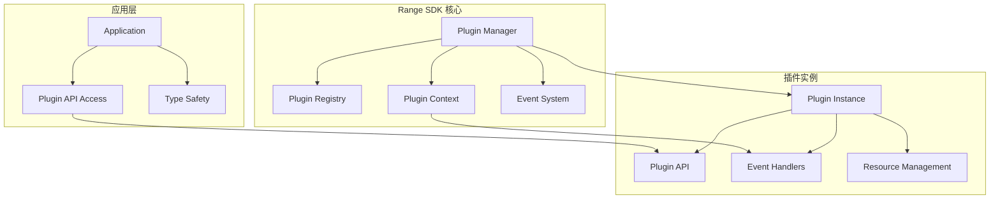
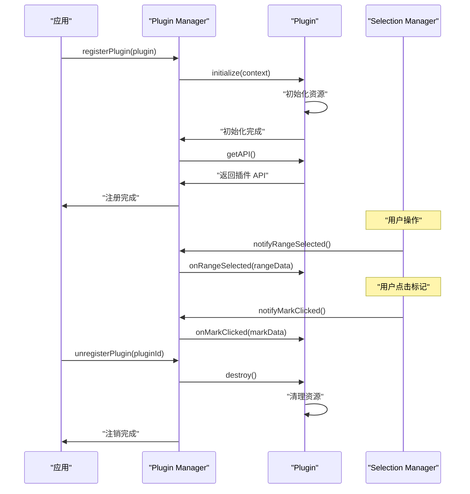

# 插件系统 API

Range SDK 的插件系统提供了强大而灵活的扩展机制。本文档详细介绍插件系统的 API 和开发指南。

## 插件架构



## 核心接口

### RangePlugin 接口

```typescript
interface RangePlugin<T extends PluginAPI = PluginAPI> {
  // 基本信息
  id: string                                    // 插件唯一标识
  name: string                                  // 插件显示名称
  version: string                               // 插件版本
  
  // 生命周期方法
  initialize(context: PluginContext): Promise<void>  // 初始化插件
  destroy?(): void                              // 销毁插件
  
  // API 提供
  getAPI(): T                                   // 获取插件 API
  
  // 事件处理（可选）
  onRangeSelected?(rangeData: RangeData): void  // 选区选择事件
  onMarkClicked?(markData: MarkData): void      // 标记点击事件
  onPluginEvent?(event: string, ...args: any[]): void  // 插件间事件
  
  // 配置和元数据（可选）
  dependencies?: string[]                       // 依赖的插件ID列表
  config?: any                                 // 插件配置
  metadata?: PluginMetadata                    // 插件元数据
}
```

### PluginAPI 基础接口

```typescript
interface PluginAPI {
  // 所有插件 API 的基础接口
  // 具体插件应该扩展此接口
}
```

### PluginContext 接口

```typescript
interface PluginContext {
  // 核心服务
  selectionManager: SelectionManager           // 选区管理器
  emit: (event: string, ...args: any[]) => void  // 事件发射器
  
  // 配置和环境
  globalConfig: any                            // 全局配置
  pluginConfig?: any                           // 插件专用配置
  
  // 可选服务
  performanceMonitor?: IPerformanceMonitor     // 性能监控器
  logger?: ILogger                             // 日志服务
  storage?: IStorage                           // 存储服务
}
```

### PluginMetadata 接口

```typescript
interface PluginMetadata {
  description?: string                         // 插件描述
  author?: string                             // 作者
  license?: string                            // 许可证
  homepage?: string                           // 主页URL
  repository?: string                         // 代码仓库
  keywords?: string[]                         // 关键词
  
  // 兼容性
  rangeSDKVersion?: string                    // 支持的SDK版本
  browserSupport?: string[]                   // 支持的浏览器
  
  // 功能特性
  features?: string[]                         // 功能列表
  permissions?: string[]                      // 所需权限
}
```

## 插件生命周期

### 生命周期流程



### 生命周期方法详解

#### initialize()

```typescript
async initialize(context: PluginContext): Promise<void>
```

插件初始化方法，在插件注册时调用。

**参数：**
- `context` - 插件上下文，包含SDK提供的服务

**实现示例：**
```typescript
async initialize(context: PluginContext): Promise<void> {
  this.context = context
  
  // 初始化插件资源
  await this.loadConfiguration()
  this.setupEventHandlers()
  this.initializeUI()
  
  // 监听SDK事件
  context.emit('plugin-initialized', this.id)
}
```

#### destroy()

```typescript
destroy?(): void
```

插件销毁方法，在插件注销时调用。

**实现示例：**
```typescript
destroy(): void {
  // 清理事件监听器
  this.removeEventHandlers()
  
  // 清理DOM元素
  this.cleanupUI()
  
  // 清理定时器
  this.clearTimers()
  
  // 清理其他资源
  this.cleanupResources()
}
```

#### getAPI()

```typescript
getAPI(): T
```

返回插件对外提供的API。

**实现示例：**
```typescript
getAPI(): MyPluginAPI {
  return {
    // 公开方法
    search: (query: string) => this.search(query),
    highlight: (text: string) => this.highlight(text),
    clear: () => this.clear(),
    
    // 配置方法
    setConfig: (config: any) => this.setConfig(config),
    getConfig: () => this.getConfig()
  }
}
```

## 插件开发示例

### 基础插件模板

```typescript
import type { RangePlugin, PluginContext, PluginAPI, RangeData, MarkData } from '@ad-audit/range-sdk'

// 定义插件API接口
export interface MyPluginAPI extends PluginAPI {
  doSomething(param: string): Promise<void>
  getSomething(): any
  configure(options: MyPluginOptions): void
}

// 定义插件配置接口
export interface MyPluginOptions {
  enabled?: boolean
  apiEndpoint?: string
  customSettings?: any
}

// 插件实现
export class MyPlugin implements RangePlugin<MyPluginAPI> {
  id = 'my-plugin'
  name = '我的插件'
  version = '1.0.0'
  
  // 插件元数据
  metadata = {
    description: '这是一个示例插件',
    author: 'Your Name',
    license: 'MIT',
    features: ['功能1', '功能2'],
    rangeSDKVersion: '^1.0.0'
  }
  
  private context?: PluginContext
  private options: MyPluginOptions
  private isInitialized = false
  
  constructor(options: MyPluginOptions = {}) {
    this.options = {
      enabled: true,
      ...options
    }
  }
  
  async initialize(context: PluginContext): Promise<void> {
    if (this.isInitialized) return
    
    this.context = context
    
    try {
      // 初始化插件逻辑
      await this.setupPlugin()
      
      this.isInitialized = true
      
      if (context.logger) {
        context.logger.info(`Plugin ${this.name} initialized successfully`)
      }
    } catch (error) {
      if (context.logger) {
        context.logger.error(`Failed to initialize plugin ${this.name}:`, error)
      }
      throw error
    }
  }
  
  private async setupPlugin(): Promise<void> {
    if (!this.options.enabled) return
    
    // 插件特定的初始化逻辑
    // 例如：加载配置、初始化UI、设置事件处理器等
  }
  
  onRangeSelected(rangeData: RangeData): void {
    if (!this.isInitialized || !this.options.enabled) return
    
    // 处理选区选择事件
    console.log('Range selected:', rangeData.selectedText)
  }
  
  onMarkClicked(markData: MarkData): void {
    if (!this.isInitialized || !this.options.enabled) return
    
    // 处理标记点击事件
    console.log('Mark clicked:', markData.selectedText)
  }
  
  getAPI(): MyPluginAPI {
    return {
      doSomething: async (param: string) => {
        if (!this.isInitialized) {
          throw new Error('Plugin not initialized')
        }
        
        // 实现具体功能
        console.log('Doing something with:', param)
      },
      
      getSomething: () => {
        return this.options
      },
      
      configure: (options: MyPluginOptions) => {
        this.options = { ...this.options, ...options }
      }
    }
  }
  
  destroy(): void {
    if (!this.isInitialized) return
    
    // 清理资源
    this.cleanup()
    
    this.isInitialized = false
    
    if (this.context?.logger) {
      this.context.logger.info(`Plugin ${this.name} destroyed`)
    }
  }
  
  private cleanup(): void {
    // 插件特定的清理逻辑
  }
}

// 工厂函数
export function createMyPlugin(options: MyPluginOptions = {}): MyPlugin {
  return new MyPlugin(options)
}
```

### 高级插件示例 - 多功能插件

```typescript
// 高级插件示例：支持依赖管理、配置验证、错误处理
export class AdvancedPlugin implements RangePlugin<AdvancedPluginAPI> {
  id = 'advanced-plugin'
  name = '高级插件'
  version = '2.0.0'
  dependencies = ['dictionary']  // 依赖词典插件
  
  private context?: PluginContext
  private config: AdvancedPluginConfig
  private services: Map<string, any> = new Map()
  private eventHandlers: Map<string, Function[]> = new Map()
  
  constructor(config: AdvancedPluginConfig) {
    // 配置验证
    this.config = this.validateConfig(config)
  }
  
  private validateConfig(config: AdvancedPluginConfig): AdvancedPluginConfig {
    const schema = {
      apiKey: { required: true, type: 'string' },
      endpoint: { required: true, type: 'string' },
      retries: { required: false, type: 'number', default: 3 }
    }
    
    // 简单的配置验证逻辑
    const validated: any = {}
    
    for (const [key, rules] of Object.entries(schema)) {
      const value = (config as any)[key]
      
      if (rules.required && value === undefined) {
        throw new Error(`Missing required config: ${key}`)
      }
      
      if (value !== undefined && typeof value !== rules.type) {
        throw new Error(`Invalid config type for ${key}: expected ${rules.type}`)
      }
      
      validated[key] = value !== undefined ? value : rules.default
    }
    
    return validated as AdvancedPluginConfig
  }
  
  async initialize(context: PluginContext): Promise<void> {
    this.context = context
    
    try {
      // 检查依赖
      await this.checkDependencies()
      
      // 初始化服务
      await this.initializeServices()
      
      // 设置错误处理
      this.setupErrorHandling()
      
      // 注册事件处理器
      this.registerEventHandlers()
      
      // 启动后台任务
      this.startBackgroundTasks()
      
    } catch (error) {
      await this.handleInitializationError(error)
      throw error
    }
  }
  
  private async checkDependencies(): Promise<void> {
    if (!this.dependencies) return
    
    for (const depId of this.dependencies) {
      if (!this.context?.pluginRegistry?.has(depId)) {
        throw new Error(`Missing dependency: ${depId}`)
      }
    }
  }
  
  private async initializeServices(): Promise<void> {
    // HTTP 客户端服务
    const httpClient = new HttpClient({
      baseURL: this.config.endpoint,
      apiKey: this.config.apiKey,
      retries: this.config.retries
    })
    
    this.services.set('http', httpClient)
    
    // 缓存服务
    const cacheService = new CacheService({
      maxSize: 100,
      ttl: 5 * 60 * 1000  // 5分钟
    })
    
    this.services.set('cache', cacheService)
  }
  
  private setupErrorHandling(): void {
    // 全局错误处理器
    process.on('uncaughtException', (error) => {
      this.handleError('uncaughtException', error)
    })
    
    process.on('unhandledRejection', (reason) => {
      this.handleError('unhandledRejection', reason)
    })
  }
  
  private registerEventHandlers(): void {
    const handlers = {
      'range-selected': [(rangeData: RangeData) => this.onRangeSelected(rangeData)],
      'mark-clicked': [(markData: MarkData) => this.onMarkClicked(markData)],
      'plugin-event': [(event: string, ...args: any[]) => this.onPluginEvent(event, ...args)]
    }
    
    for (const [event, handlerList] of Object.entries(handlers)) {
      this.eventHandlers.set(event, handlerList)
    }
  }
  
  private startBackgroundTasks(): void {
    // 定期清理缓存
    setInterval(() => {
      const cache = this.services.get('cache')
      if (cache) {
        cache.cleanup()
      }
    }, 60 * 1000)  // 每分钟
    
    // 健康检查
    setInterval(() => {
      this.performHealthCheck()
    }, 5 * 60 * 1000)  // 每5分钟
  }
  
  private async performHealthCheck(): Promise<void> {
    try {
      const http = this.services.get('http')
      if (http) {
        await http.get('/health')
      }
    } catch (error) {
      this.context?.logger?.warn('Health check failed:', error)
    }
  }
  
  onRangeSelected(rangeData: RangeData): void {
    try {
      // 异步处理，避免阻塞主线程
      setImmediate(() => this.processRangeSelection(rangeData))
    } catch (error) {
      this.handleError('onRangeSelected', error)
    }
  }
  
  private async processRangeSelection(rangeData: RangeData): Promise<void> {
    const cache = this.services.get('cache')
    const cacheKey = `selection_${rangeData.id}`
    
    // 检查缓存
    if (cache?.has(cacheKey)) {
      return cache.get(cacheKey)
    }
    
    try {
      // 处理选区数据
      const result = await this.analyzeSelection(rangeData)
      
      // 缓存结果
      if (cache) {
        cache.set(cacheKey, result)
      }
      
      // 发射事件
      this.context?.emit('advanced-plugin-selection-processed', result)
      
    } catch (error) {
      this.handleError('processRangeSelection', error)
    }
  }
  
  private async analyzeSelection(rangeData: RangeData): Promise<any> {
    const http = this.services.get('http')
    
    return await http.post('/analyze', {
      text: rangeData.selectedText,
      context: {
        before: rangeData.contextBefore,
        after: rangeData.contextAfter
      }
    })
  }
  
  onPluginEvent(event: string, ...args: any[]): void {
    const handlers = this.eventHandlers.get('plugin-event')
    if (handlers) {
      handlers.forEach(handler => {
        try {
          handler(event, ...args)
        } catch (error) {
          this.handleError('onPluginEvent', error)
        }
      })
    }
  }
  
  getAPI(): AdvancedPluginAPI {
    return {
      analyze: async (text: string) => {
        const http = this.services.get('http')
        return await http.post('/analyze', { text })
      },
      
      clearCache: () => {
        const cache = this.services.get('cache')
        if (cache) {
          cache.clear()
        }
      },
      
      getStats: () => {
        const cache = this.services.get('cache')
        return {
          cacheSize: cache?.size || 0,
          cacheHitRate: cache?.hitRate || 0
        }
      },
      
      configure: (newConfig: Partial<AdvancedPluginConfig>) => {
        this.config = { ...this.config, ...newConfig }
      }
    }
  }
  
  private handleError(context: string, error: any): void {
    const errorInfo = {
      context,
      error: error.message || error.toString(),
      timestamp: Date.now(),
      pluginId: this.id
    }
    
    this.context?.logger?.error('Plugin error:', errorInfo)
    this.context?.emit('plugin-error', errorInfo)
  }
  
  private async handleInitializationError(error: any): Promise<void> {
    this.context?.logger?.error(`Failed to initialize plugin ${this.name}:`, error)
    
    // 清理已初始化的资源
    this.cleanup()
  }
  
  private cleanup(): void {
    // 停止后台任务
    this.stopBackgroundTasks()
    
    // 清理服务
    this.services.forEach(service => {
      if (service && typeof service.destroy === 'function') {
        service.destroy()
      }
    })
    this.services.clear()
    
    // 清理事件处理器
    this.eventHandlers.clear()
  }
  
  private stopBackgroundTasks(): void {
    // 清理定时器等
  }
  
  destroy(): void {
    this.cleanup()
  }
}
```

## 插件管理器 API

### Plugin Manager 核心方法

```typescript
class PluginManager {
  /**
   * 注册插件
   */
  async register<T extends PluginAPI>(plugin: RangePlugin<T>): Promise<void>
  
  /**
   * 注销插件
   */
  unregister(pluginId: string): void
  
  /**
   * 获取插件实例
   */
  getPlugin<T extends RangePlugin>(pluginId: string): T | undefined
  
  /**
   * 获取插件API
   */
  getPluginAPI<T extends PluginAPI>(pluginId: string): T | undefined
  
  /**
   * 列出所有已注册的插件
   */
  listPlugins(): PluginInfo[]
  
  /**
   * 检查插件是否已注册
   */
  hasPlugin(pluginId: string): boolean
  
  /**
   * 通知插件选区选择事件
   */
  notifyRangeSelected(rangeData: RangeData): void
  
  /**
   * 通知插件标记点击事件
   */
  notifyMarkClicked(markData: MarkData): void
  
  /**
   * 发送插件间事件
   */
  emitPluginEvent(event: string, ...args: any[]): void
  
  /**
   * 销毁所有插件
   */
  destroy(): void
}
```

### 插件信息接口

```typescript
interface PluginInfo {
  id: string
  name: string
  version: string
  metadata?: PluginMetadata
  isInitialized: boolean
  dependencies?: string[]
  registeredAt: number
}
```

## 类型安全支持

### 插件类型声明

```typescript
// 扩展 SDK 类型以包含插件 API
declare module '@ad-audit/range-sdk' {
  interface PluginRegistry {
    dictionary: DictionaryAPI
    comment: CommentAPI
    'my-plugin': MyPluginAPI
  }
}

// 使用类型安全的 SDK 实例
const sdk = new RangeSDK() as RangeSDK & PluginRegistry
await sdk.dictionary.search({ words: ['API'] })  // ✅ 类型安全
```

### 创建类型安全的插件组合

```typescript
import type { BaseRangeSDK, CombinePlugins, WithDictionary, WithComment } from '@ad-audit/range-sdk'

// 组合多个插件类型
type MySDKType = BaseRangeSDK & 
  WithDictionary<DictionaryAPI> & 
  WithComment<CommentAPI>

// 或者使用 CombinePlugins 工具类型
type MySDKType2 = CombinePlugins<BaseRangeSDK, [
  WithDictionary<DictionaryAPI>,
  WithComment<CommentAPI>
]>

// 创建类型安全的 SDK 工厂
function createMySDK(): MySDKType {
  const sdk = new RangeSDK()
  // 注册插件的逻辑...
  return sdk as MySDKType
}
```

## 插件间通信

### 事件系统

```typescript
// 插件A发送事件
class PluginA implements RangePlugin<PluginAAPI> {
  private context?: PluginContext
  
  someMethod() {
    // 发送事件给其他插件
    this.context?.emit('plugin-a-event', { data: 'some data' })
  }
}

// 插件B接收事件
class PluginB implements RangePlugin<PluginBAPI> {
  onPluginEvent(event: string, ...args: any[]): void {
    if (event === 'plugin-a-event') {
      console.log('Received event from Plugin A:', args)
    }
  }
}
```

### 直接 API 调用

```typescript
class PluginB implements RangePlugin<PluginBAPI> {
  private context?: PluginContext
  
  async usePluginA() {
    // 获取其他插件的API
    const pluginAAPI = this.context?.getPluginAPI?.('plugin-a') as PluginAAPI
    
    if (pluginAAPI) {
      await pluginAAPI.someMethod()
    }
  }
}
```

## 错误处理最佳实践

### 插件级错误处理

```typescript
class RobustPlugin implements RangePlugin<RobustPluginAPI> {
  private errorCount = 0
  private maxErrors = 5
  
  onRangeSelected(rangeData: RangeData): void {
    try {
      this.processRangeData(rangeData)
    } catch (error) {
      this.handleError('onRangeSelected', error)
    }
  }
  
  private handleError(method: string, error: any): void {
    this.errorCount++
    
    // 记录错误
    this.context?.logger?.error(`Error in ${method}:`, error)
    
    // 错误次数过多时进入安全模式
    if (this.errorCount >= this.maxErrors) {
      this.enterSafeMode()
    }
    
    // 向用户报告错误
    this.reportErrorToUser(error)
  }
  
  private enterSafeMode(): void {
    console.warn('Plugin entering safe mode due to too many errors')
    // 禁用高风险功能
    this.isInSafeMode = true
  }
  
  private reportErrorToUser(error: any): void {
    // 显示用户友好的错误信息
    this.context?.emit('user-notification', {
      type: 'error',
      message: '插件遇到问题，某些功能可能不可用'
    })
  }
}
```

## 测试插件

### 单元测试示例

```typescript
import { describe, it, expect, beforeEach } from 'vitest'
import { MyPlugin } from './my-plugin'
import type { PluginContext } from '@ad-audit/range-sdk'

describe('MyPlugin', () => {
  let plugin: MyPlugin
  let mockContext: PluginContext
  
  beforeEach(() => {
    mockContext = {
      selectionManager: {
        // mock selection manager
      },
      emit: vi.fn(),
      globalConfig: {},
      performanceMonitor: {
        // mock performance monitor
      }
    } as any
    
    plugin = new MyPlugin({
      enabled: true,
      apiEndpoint: 'https://test-api.com'
    })
  })
  
  it('should initialize successfully', async () => {
    await expect(plugin.initialize(mockContext)).resolves.not.toThrow()
    expect(plugin.isInitialized).toBe(true)
  })
  
  it('should handle range selection', () => {
    const rangeData = {
      id: 'test-range',
      selectedText: 'test text',
      // ... other properties
    } as any
    
    expect(() => plugin.onRangeSelected(rangeData)).not.toThrow()
  })
  
  it('should provide correct API', () => {
    const api = plugin.getAPI()
    
    expect(api).toHaveProperty('doSomething')
    expect(api).toHaveProperty('getSomething')
    expect(api).toHaveProperty('configure')
  })
  
  it('should cleanup on destroy', () => {
    plugin.destroy()
    expect(plugin.isInitialized).toBe(false)
  })
})
```

### 集成测试示例

```typescript
import { describe, it, expect } from 'vitest'
import { RangeSDK } from '@ad-audit/range-sdk'
import { MyPlugin } from './my-plugin'

describe('MyPlugin Integration', () => {
  let sdk: RangeSDK
  let plugin: MyPlugin
  
  beforeEach(() => {
    sdk = new RangeSDK({
      container: document.body,
      debug: true
    })
    
    plugin = new MyPlugin()
  })
  
  afterEach(() => {
    sdk.destroy()
  })
  
  it('should integrate with SDK correctly', async () => {
    await sdk.registerPlugin(plugin)
    
    expect(sdk.getPlugin('my-plugin')).toBe(plugin)
    expect((sdk as any)['my-plugin']).toBeDefined()
  })
  
  it('should receive SDK events', async () => {
    const onRangeSelected = vi.spyOn(plugin, 'onRangeSelected')
    
    await sdk.registerPlugin(plugin)
    
    // 模拟选区事件
    sdk.emit('range-selected', {
      id: 'test',
      selectedText: 'test',
      // ... other properties
    } as any)
    
    expect(onRangeSelected).toHaveBeenCalled()
  })
})
```

---

插件系统为 Range SDK 提供了强大的扩展能力。通过遵循这些 API 规范和最佳实践，您可以开发出高质量、可维护的插件。

更多信息请参考：
- [插件开发指南](../plugins/development-guide.md)
- [类型参考](./type-reference.md)
- [核心 API](./core-api.md)