# 架构设计概览

Range SDK 采用模块化、可扩展的架构设计，旨在为企业级文档应用提供强大而灵活的选区管理能力。

## 总体架构

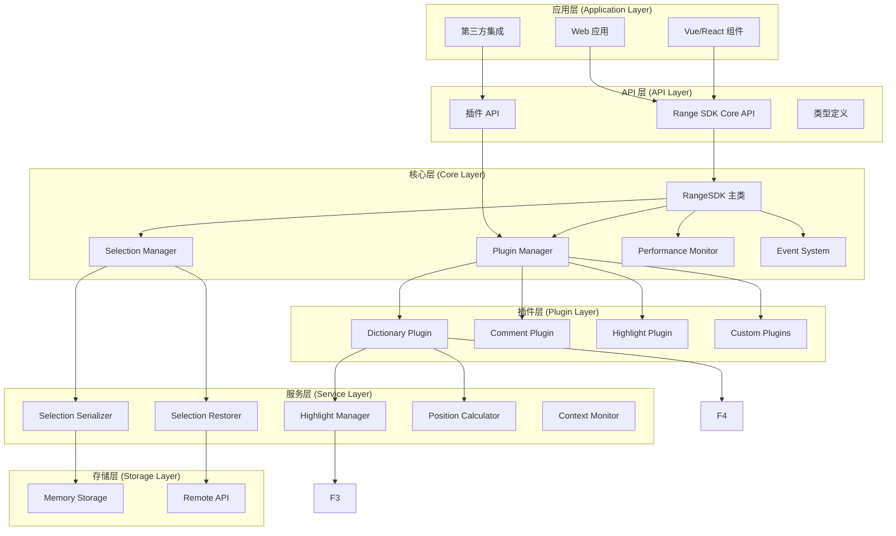
```mermaid
graph TB
    subgraph APP["应用层 (Application Layer)"]
        A1["Web 应用"]
        A2["Vue/React 组件"]
        A3["第三方集成"]
    end
    
    subgraph API["API 层 (API Layer)"]
        B1["Range SDK Core API"]
        B2["插件 API"]
        B3["类型定义"]
    end
    
    subgraph CORE["核心层 (Core Layer)"]
        C1["RangeSDK 主类"]
        C2["Selection Manager"]
        C3["Plugin Manager"]
        C4["Performance Monitor"]
        C5["Event System"]
    end
    
    subgraph PLUGIN["插件层 (Plugin Layer)"]
        D1["Dictionary Plugin"]
        D2["Comment Plugin"]
        D3["Highlight Plugin"]
        D4["Custom Plugins"]
    end
    
    subgraph SERVICE["服务层 (Service Layer)"]
        E1["Selection Serializer"]
        E2["Selection Restorer"]
        E3["Highlight Manager"]
        E4["Position Calculator"]
        E5["Context Monitor"]
    end
    
    subgraph STORAGE["存储层 (Storage Layer)"]
        F1["Memory Storage"]
        F2["Remote API"]
    end
    
    A1 --> B1
    A2 --> B1
    A3 --> B2
    B1 --> C1
    B2 --> C3
    C1 --> C2
    C1 --> C3
    C1 --> C4
    C1 --> C5
    C3 --> D1
    C3 --> D2
    C3 --> D3
    C3 --> D4
    C2 --> E1
    C2 --> E2
    D1 --> E3
    D1 --> E4
    E1 --> F1
    E2 --> F2
    E3 --> F3
    D1 --> F4
```

## 核心组件架构

### 1. RangeSDK 主类

RangeSDK 主类是整个系统的入口点和协调中心：

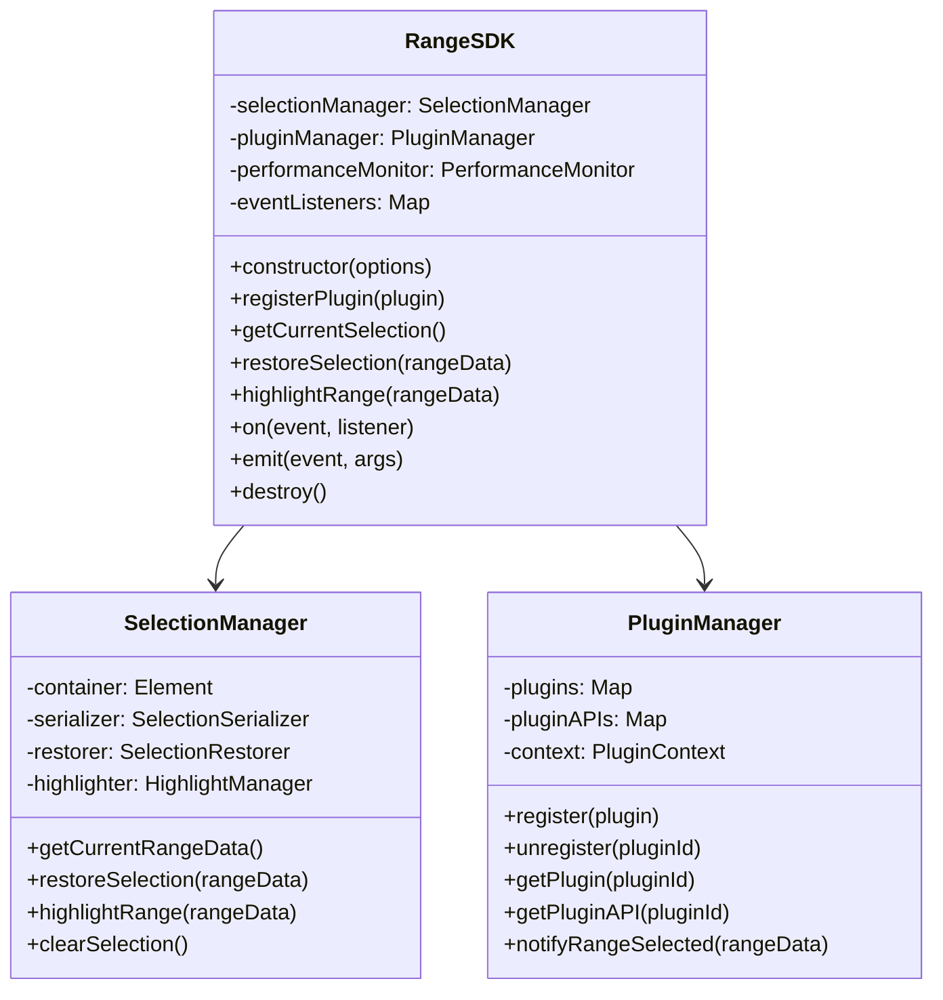
```mermaid
classDiagram
    class RangeSDK {
        -selectionManager: SelectionManager
        -pluginManager: PluginManager
        -performanceMonitor: PerformanceMonitor
        -eventListeners: Map
        
        +constructor(options)
        +registerPlugin(plugin)
        +getCurrentSelection()
        +restoreSelection(rangeData)
        +highlightRange(rangeData)
        +on(event, listener)
        +emit(event, args)
        +destroy()
    }
    
    class SelectionManager {
        -container: Element
        -serializer: SelectionSerializer
        -restorer: SelectionRestorer
        -highlighter: HighlightManager
        
        +getCurrentRangeData()
        +restoreSelection(rangeData)
        +highlightRange(rangeData)
        +clearSelection()
    }
    
    class PluginManager {
        -plugins: Map
        -pluginAPIs: Map
        -context: PluginContext
        
        +register(plugin)
        +unregister(pluginId)
        +getPlugin(pluginId)
        +getPluginAPI(pluginId)
        +notifyRangeSelected(rangeData)
    }
    
    RangeSDK --> SelectionManager
    RangeSDK --> PluginManager
```

### 2. 选区管理架构

选区管理系统负责文本选区的捕获、序列化、存储和恢复：

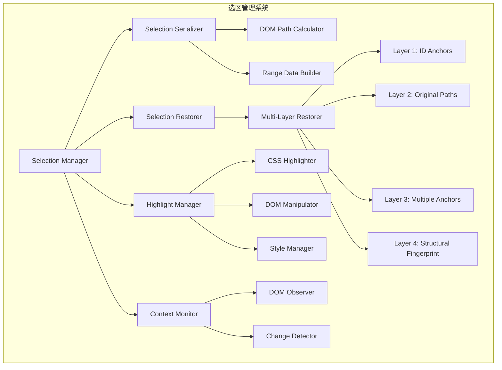
```mermaid
graph TB
    subgraph SELECTION_SYS["选区管理系统"]
        A["Selection Manager"] --> B["Selection Serializer"]
        A --> C["Selection Restorer"]
        A --> D["Highlight Manager"]
        A --> E["Context Monitor"]
        
        B --> F["DOM Path Calculator"]
        B --> G["Range Data Builder"]
        
        C --> H["Multi-Layer Restorer"]
        H --> H1["Layer 1: ID Anchors"]
        H --> H2["Layer 2: Original Paths"]
        H --> H3["Layer 3: Multiple Anchors"]
        H --> H4["Layer 4: Structural Fingerprint"]
        
        D --> I["CSS Highlighter"]
        D --> J["DOM Manipulator"]
        D --> K["Style Manager"]
        
        E --> L["DOM Observer"]
        E --> M["Change Detector"]
    end
```

#### 选区序列化流程

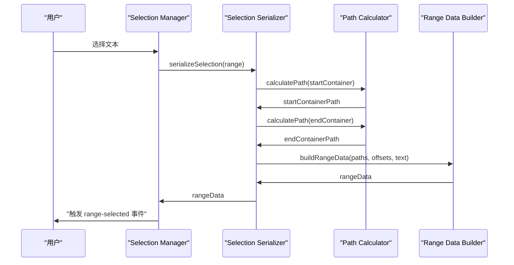
```mermaid
sequenceDiagram
    participant U as "用户"
    participant SM as "Selection Manager"
    participant SS as "Selection Serializer"
    participant PC as "Path Calculator"
    participant RDB as "Range Data Builder"
    
    U->>SM: 选择文本
    SM->>SS: serializeSelection(range)
    SS->>PC: calculatePath(startContainer)
    PC->>SS: startContainerPath
    SS->>PC: calculatePath(endContainer)
    PC->>SS: endContainerPath
    SS->>RDB: buildRangeData(paths, offsets, text)
    RDB->>SS: rangeData
    SS->>SM: rangeData
    SM->>U: "触发 range-selected 事件"
```

#### 选区恢复算法

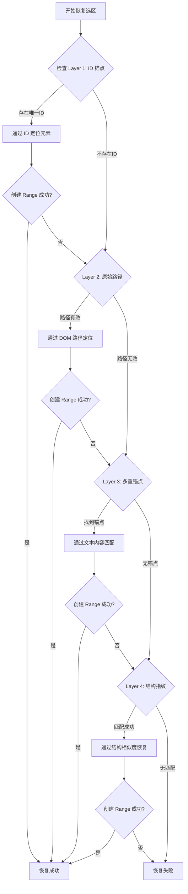
```mermaid
flowchart TD
    A["开始恢复选区"] --> B{"检查 Layer 1: ID 锚点"}
    B -->|"存在唯一ID"| C["通过 ID 定位元素"]
    C --> D{"创建 Range 成功?"}
    D -->|"是"| SUCCESS["恢复成功"]
    D -->|"否"| E{"Layer 2: 原始路径"}
    
    B -->|"不存在ID"| E
    E -->|"路径有效"| F["通过 DOM 路径定位"]
    F --> G{"创建 Range 成功?"}
    G -->|"是"| SUCCESS
    G -->|"否"| H{"Layer 3: 多重锚点"}
    
    E -->|"路径无效"| H
    H -->|"找到锚点"| I["通过文本内容匹配"]
    I --> J{"创建 Range 成功?"}
    J -->|"是"| SUCCESS
    J -->|"否"| K{"Layer 4: 结构指纹"}
    
    H -->|"无锚点"| K
    K -->|"匹配成功"| L["通过结构相似度恢复"]
    L --> M{"创建 Range 成功?"}
    M -->|"是"| SUCCESS
    M -->|"否"| FAIL["恢复失败"]
    
    K -->|"无匹配"| FAIL
```

### 3. 插件系统架构

插件系统提供了灵活的扩展机制：

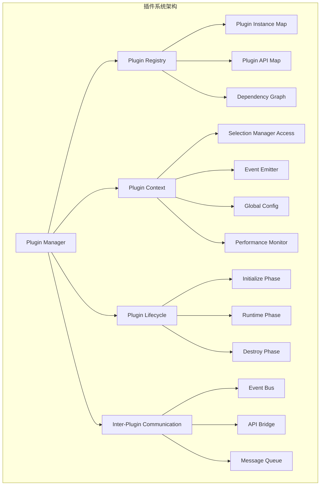
```mermaid
graph TB
    subgraph PLUGIN_SYS["插件系统架构"]
        A["Plugin Manager"] --> B["Plugin Registry"]
        A --> C["Plugin Context"]
        A --> D["Plugin Lifecycle"]
        A --> E["Inter-Plugin Communication"]
        
        B --> F["Plugin Instance Map"]
        B --> G["Plugin API Map"]
        B --> H["Dependency Graph"]
        
        C --> I["Selection Manager Access"]
        C --> J["Event Emitter"]
        C --> K["Global Config"]
        C --> L["Performance Monitor"]
        
        D --> M["Initialize Phase"]
        D --> N["Runtime Phase"]
        D --> O["Destroy Phase"]
        
        E --> P["Event Bus"]
        E --> Q["API Bridge"]
        E --> R["Message Queue"]
    end
```

#### 插件生命周期管理

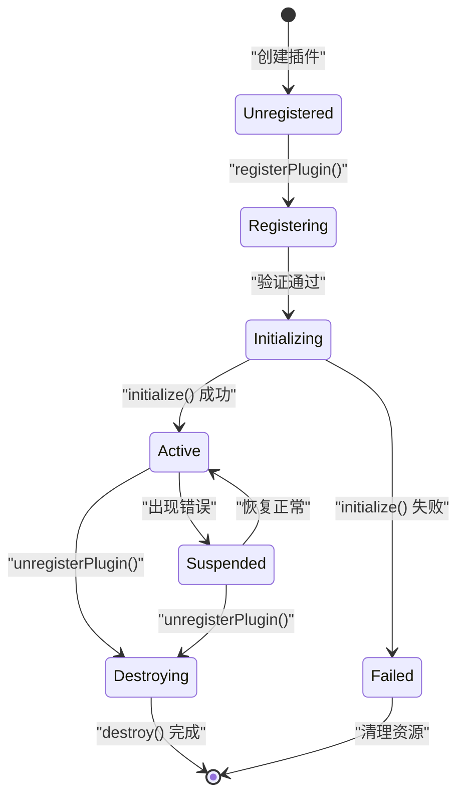
```mermaid
stateDiagram-v2
    [*] --> Unregistered: "创建插件"
    Unregistered --> Registering: "registerPlugin()"
    Registering --> Initializing: "验证通过"
    Initializing --> Active: "initialize() 成功"
    Initializing --> Failed: "initialize() 失败"
    Active --> Suspended: "出现错误"
    Suspended --> Active: "恢复正常"
    Active --> Destroying: "unregisterPlugin()"
    Suspended --> Destroying: "unregisterPlugin()"
    Destroying --> [*]: "destroy() 完成"
    Failed --> [*]: "清理资源"
```

### 4. 事件系统架构

事件系统实现组件间的松耦合通信：

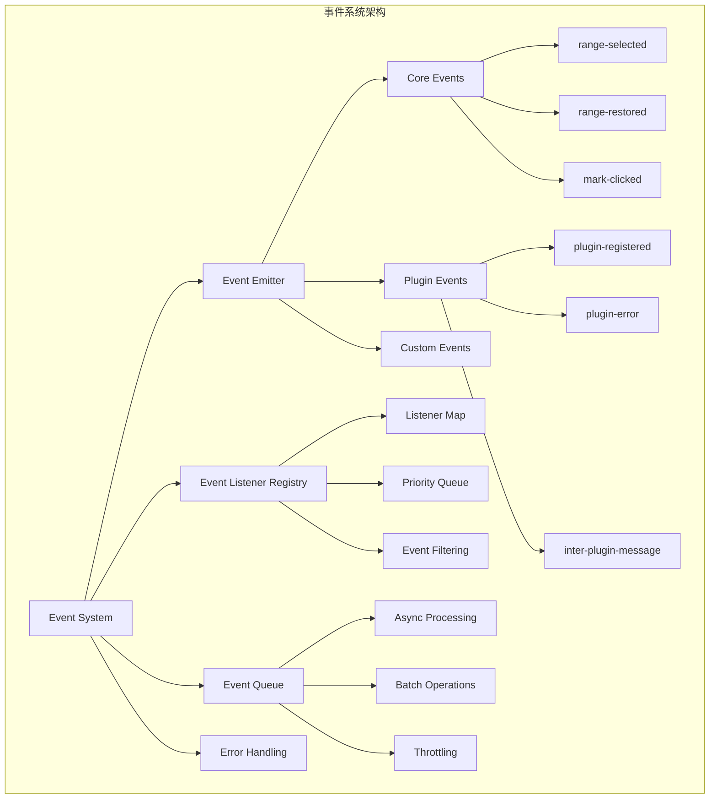
```mermaid
graph TB
    subgraph EVENT_SYS["事件系统架构"]
        A["Event System"] --> B["Event Emitter"]
        A --> C["Event Listener Registry"]
        A --> D["Event Queue"]
        A --> E["Error Handling"]
        
        B --> F["Core Events"]
        B --> G["Plugin Events"]
        B --> H["Custom Events"]
        
        F --> F1["range-selected"]
        F --> F2["range-restored"]
        F --> F3["mark-clicked"]
        
        G --> G1["plugin-registered"]
        G --> G2["plugin-error"]
        G --> G3["inter-plugin-message"]
        
        C --> I["Listener Map"]
        C --> J["Priority Queue"]
        C --> K["Event Filtering"]
        
        D --> L["Async Processing"]
        D --> M["Batch Operations"]
        D --> N["Throttling"]
    end
```

### 5. 性能监控架构

性能监控系统确保 SDK 的高性能运行：

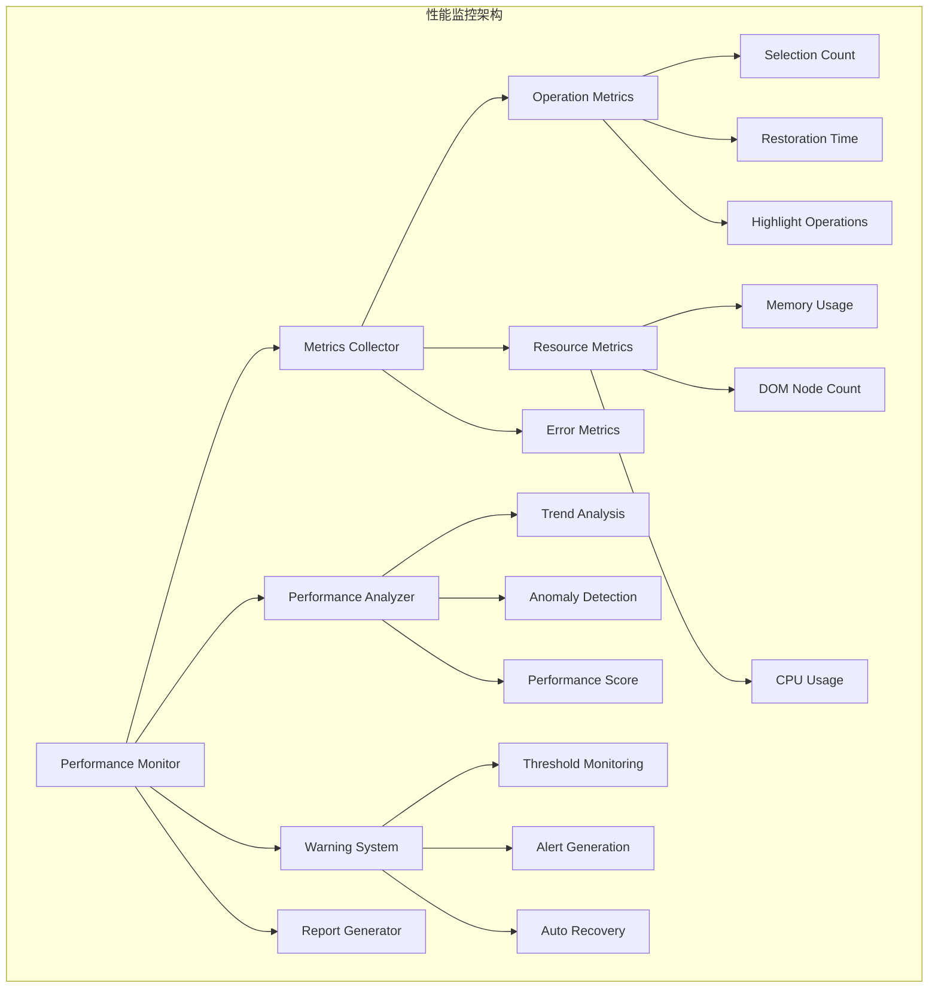
```mermaid
graph TB
    subgraph PERF_SYS["性能监控架构"]
        A["Performance Monitor"] --> B["Metrics Collector"]
        A --> C["Performance Analyzer"]
        A --> D["Warning System"]
        A --> E["Report Generator"]
        
        B --> F["Operation Metrics"]
        B --> G["Resource Metrics"]
        B --> H["Error Metrics"]
        
        F --> F1["Selection Count"]
        F --> F2["Restoration Time"]
        F --> F3["Highlight Operations"]
        
        G --> G1["Memory Usage"]
        G --> G2["DOM Node Count"]
        G --> G3["CPU Usage"]
        
        C --> I["Trend Analysis"]
        C --> J["Anomaly Detection"]
        C --> K["Performance Score"]
        
        D --> L["Threshold Monitoring"]
        D --> M["Alert Generation"]
        D --> N["Auto Recovery"]
    end
```

## 数据流架构

### 选区数据流

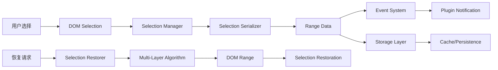
```mermaid
flowchart LR
    A["用户选择"] --> B["DOM Selection"]
    B --> C["Selection Manager"]
    C --> D["Selection Serializer"]
    D --> E["Range Data"]
    E --> F["Event System"]
    F --> G["Plugin Notification"]
    E --> H["Storage Layer"]
    H --> I["Cache/Persistence"]
    
    J["恢复请求"] --> K["Selection Restorer"]
    K --> L["Multi-Layer Algorithm"]
    L --> M["DOM Range"]
    M --> N["Selection Restoration"]
```

### 插件数据流

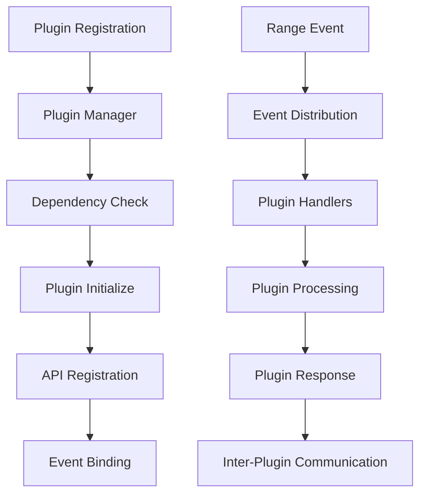
```mermaid
flowchart TB
    A["Plugin Registration"] --> B["Plugin Manager"]
    B --> C["Dependency Check"]
    C --> D["Plugin Initialize"]
    D --> E["API Registration"]
    E --> F["Event Binding"]
    
    G["Range Event"] --> H["Event Distribution"]
    H --> I["Plugin Handlers"]
    I --> J["Plugin Processing"]
    J --> K["Plugin Response"]
    K --> L["Inter-Plugin Communication"]
```

## 存储架构

### 存储设计

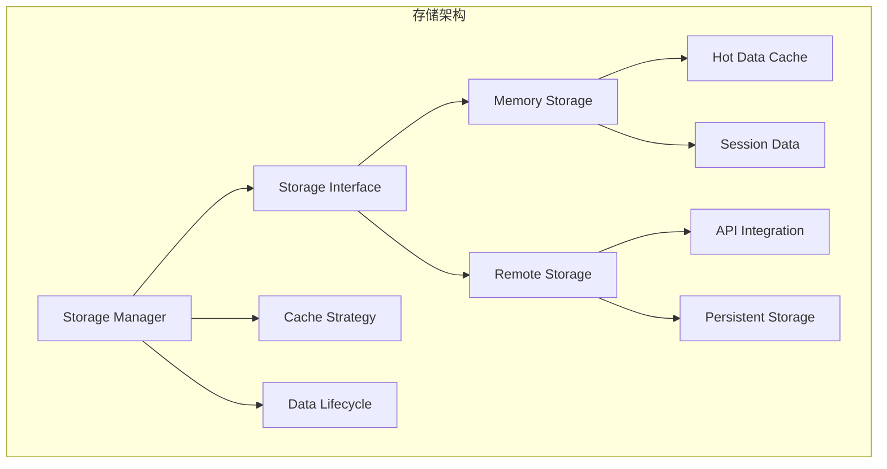
```mermaid
graph TB
    subgraph STORAGE_SYS["存储架构"]
        A["Storage Interface"] --> B["Memory Storage"]
        A --> E["Remote Storage"]

        B --> B1["Hot Data Cache"]
        B --> B2["Session Data"]

        E --> E1["API Integration"]
        E --> E2["Persistent Storage"]

        F["Storage Manager"] --> A
        F --> G["Cache Strategy"]
        F --> H["Data Lifecycle"]
    end
```

### 缓存策略

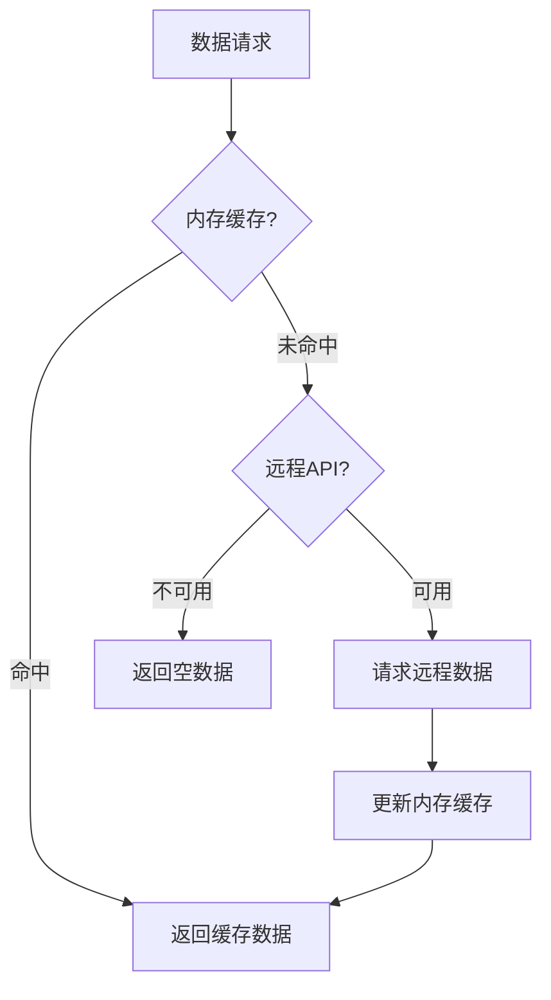
```mermaid
flowchart TD
    A["数据请求"] --> B{"内存缓存?"}
    B -->|"命中"| C["返回缓存数据"]
    B -->|"未命中"| D{"远程API?"}
    D -->|"可用"| E["请求远程数据"]
    E --> F["更新内存缓存"]
    F --> C
    D -->|"不可用"| G["返回空数据"]
```

## 错误处理架构

### 错误处理层次

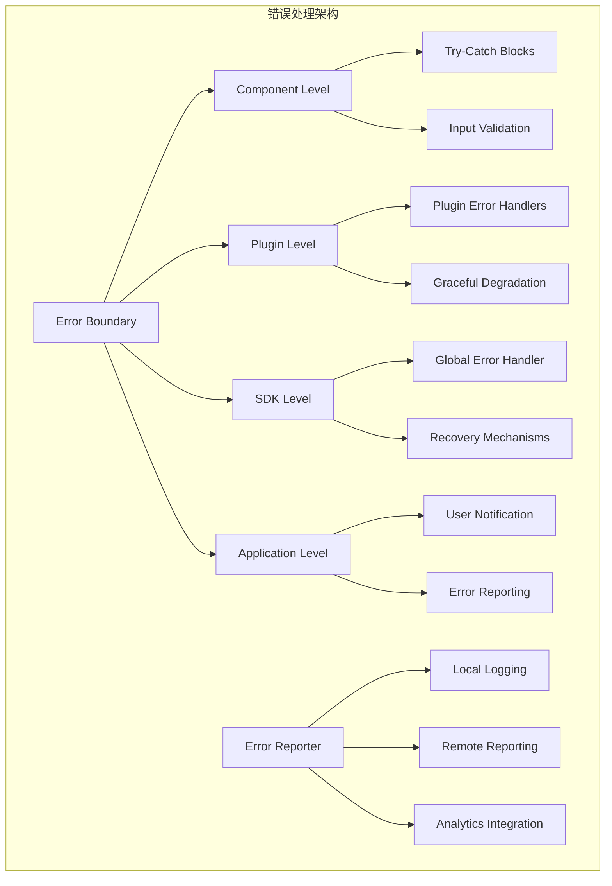
```mermaid
graph TB
    subgraph ERROR_SYS["错误处理架构"]
        A["Error Boundary"] --> B["Component Level"]
        A --> C["Plugin Level"]
        A --> D["SDK Level"]
        A --> E["Application Level"]
        
        B --> F["Try-Catch Blocks"]
        B --> G["Input Validation"]
        
        C --> H["Plugin Error Handlers"]
        C --> I["Graceful Degradation"]
        
        D --> J["Global Error Handler"]
        D --> K["Recovery Mechanisms"]
        
        E --> L["User Notification"]
        E --> M["Error Reporting"]
        
        N["Error Reporter"] --> O["Local Logging"]
        N --> P["Remote Reporting"]
        N --> Q["Analytics Integration"]
    end
```

### 错误恢复流程

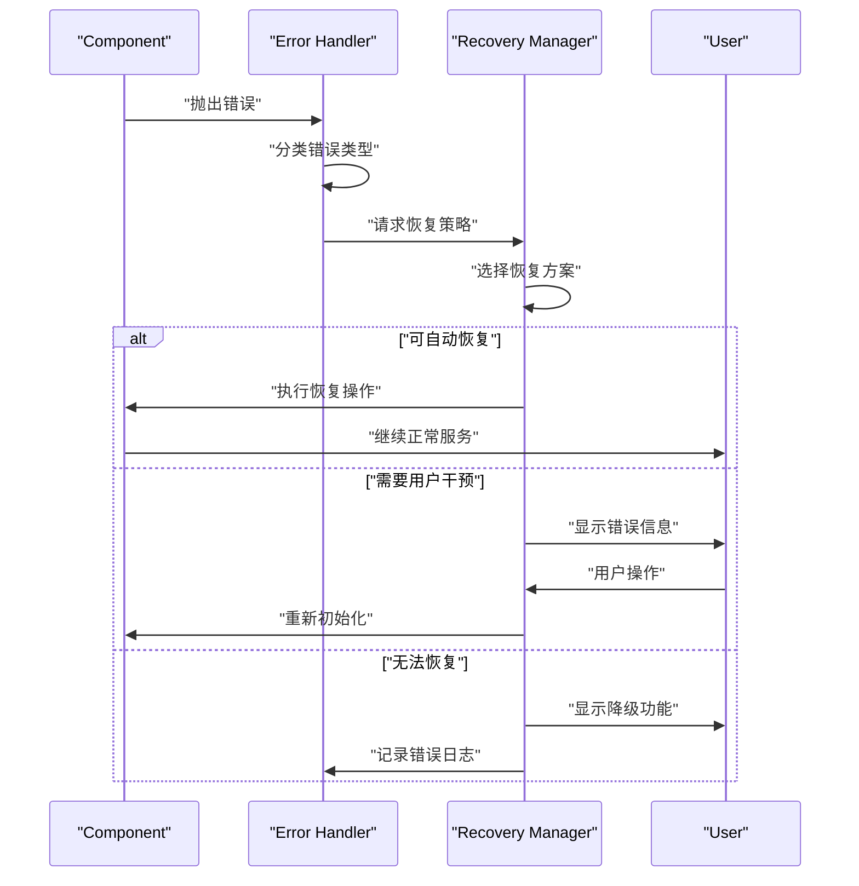
```mermaid
sequenceDiagram
    participant C as "Component"
    participant EH as "Error Handler"
    participant RM as "Recovery Manager"
    participant U as "User"
    
    C->>EH: "抛出错误"
    EH->>EH: "分类错误类型"
    EH->>RM: "请求恢复策略"
    RM->>RM: "选择恢复方案"
    
    alt "可自动恢复"
        RM->>C: "执行恢复操作"
        C->>U: "继续正常服务"
    else "需要用户干预"
        RM->>U: "显示错误信息"
        U->>RM: "用户操作"
        RM->>C: "重新初始化"
    else "无法恢复"
        RM->>U: "显示降级功能"
        RM->>EH: "记录错误日志"
    end
```

## 扩展点设计

Range SDK 提供了多个扩展点以支持定制化需求：

### 1. 插件扩展点

```typescript
interface ExtensionPoints {
  // 选区处理扩展
  selectionProcessors: SelectionProcessor[]
  
  // 高亮样式扩展
  highlightRenderers: HighlightRenderer[]
  
  // 存储扩展
  storageProviders: StorageProvider[]
  
  // 事件处理扩展
  eventHandlers: EventHandler[]
  
  // 错误处理扩展
  errorHandlers: ErrorHandler[]
}
```

### 2. 中间件系统

```typescript
interface Middleware {
  name: string
  priority: number
  
  beforeSelection?(context: SelectionContext): Promise<SelectionContext>
  afterSelection?(context: SelectionContext, result: RangeData): Promise<RangeData>
  
  beforeRestore?(context: RestoreContext): Promise<RestoreContext>
  afterRestore?(context: RestoreContext, result: Range): Promise<Range>
  
  onError?(error: Error, context: any): Promise<void>
}
```

## 部署架构

### 模块化部署

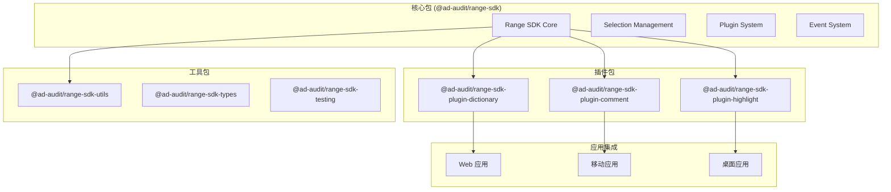
```mermaid
graph TB
    subgraph CORE_PKG["核心包 (@ad-audit/range-sdk)"]
        A["Range SDK Core"]
        B["Selection Management"]
        C["Plugin System"]
        D["Event System"]
    end
    
    subgraph PLUGIN_PKG["插件包"]
        E["@ad-audit/range-sdk-plugin-dictionary"]
        F["@ad-audit/range-sdk-plugin-comment"]
        G["@ad-audit/range-sdk-plugin-highlight"]
    end
    
    subgraph UTIL_PKG["工具包"]
        H["@ad-audit/range-sdk-utils"]
        I["@ad-audit/range-sdk-types"]
        J["@ad-audit/range-sdk-testing"]
    end
    
    subgraph APP_INT["应用集成"]
        K["Web 应用"]
        L["移动应用"]
        M["桌面应用"]
    end
    
    A --> E
    A --> F
    A --> G
    A --> H
    E --> K
    F --> L
    G --> M
```

### CDN 部署

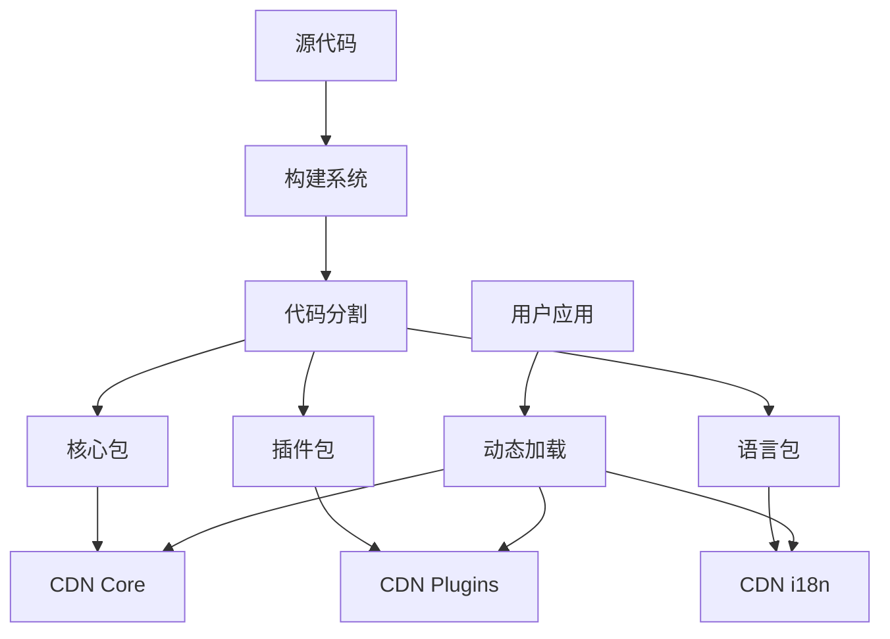
```mermaid
graph TB
    A["源代码"] --> B["构建系统"]
    B --> C["代码分割"]
    C --> D["核心包"]
    C --> E["插件包"]
    C --> F["语言包"]
    
    D --> G["CDN Core"]
    E --> H["CDN Plugins"]
    F --> I["CDN i18n"]
    
    J["用户应用"] --> K["动态加载"]
    K --> G
    K --> H
    K --> I
```

## 性能优化策略

### 1. 代码分割

- **核心功能**：基础选区管理
- **插件系统**：按需加载
- **工具函数**：懒加载
- **类型定义**：开发时依赖

### 2. 内存管理

- **对象池**：复用频繁创建的对象
- **弱引用**：避免内存泄漏
- **定期清理**：清理不再使用的缓存
- **垃圾回收**：优化对象生命周期

### 3. DOM 优化

- **批量操作**：减少 DOM 重绘
- **事件委托**：减少事件监听器数量
- **虚拟滚动**：处理大量数据
- **防抖节流**：优化高频操作

### 4. 网络优化

- **请求合并**：减少网络请求
- **数据压缩**：减少传输大小
- **缓存策略**：提高响应速度
- **离线支持**：增强用户体验

这种分层、模块化的架构设计确保了 Range SDK 的可扩展性、可维护性和高性能。通过清晰的职责分离和松耦合的组件设计，SDK 能够适应各种复杂的使用场景和定制需求。