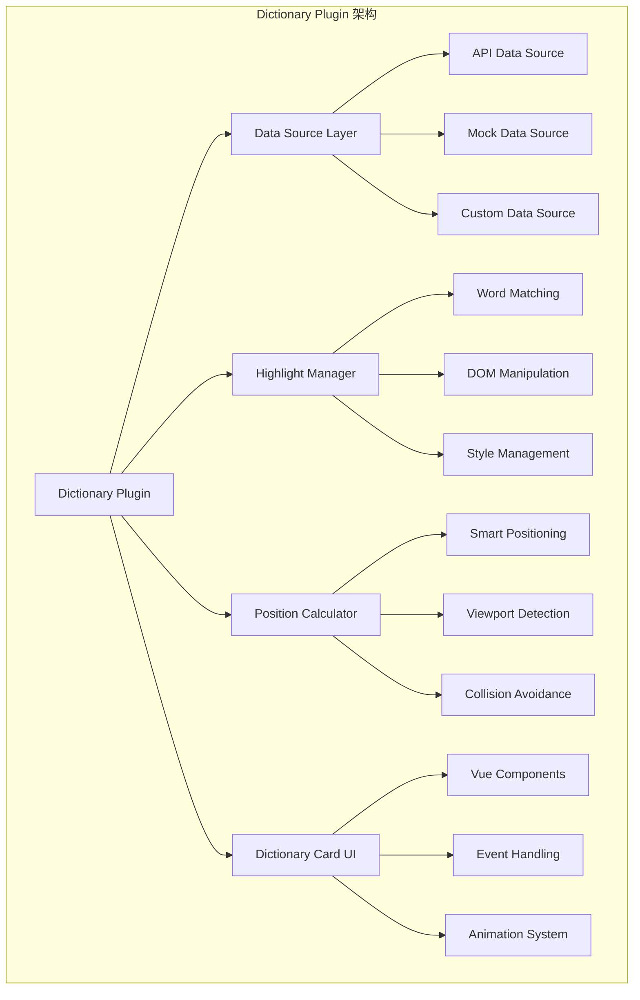

# Dictionary 插件最佳实践

Dictionary 插件是 Range SDK 的核心插件之一，提供企业级词汇管理和知识展示功能。本文档详细介绍如何高效地使用和配置 Dictionary 插件。

## 概述

Dictionary 插件的主要功能：
- **智能词汇识别**：自动识别并高亮文档中的专业术语
- **知识卡片展示**：点击词汇显示详细解释和相关信息
- **多数据源支持**：支持 API、本地数据、模拟数据等多种数据源
- **智能定位算法**：自动计算卡片最佳显示位置
- **性能优化**：内置缓存和批量处理机制

## 核心架构



## 基础配置

### 1. 基本集成

```typescript
import { RangeSDK } from '@ad-audit/range-sdk'
import { createDictionaryPlugin } from '@ad-audit/range-sdk-plugin-dictionary'

// 创建 SDK 实例
const rangeSDK = new RangeSDK({
  container: document.querySelector('.content-area'),
  debug: true
})

// 创建 Dictionary 插件
const dictionaryPlugin = createDictionaryPlugin({
  // 基础配置
  highlightStyle: {
    backgroundColor: 'rgba(24, 144, 255, 0.1)',
    borderBottom: '2px solid #1890ff',
    cursor: 'pointer',
    borderRadius: '2px'
  },
  autoHighlight: true
})

// 注册插件
await rangeSDK.registerPlugin(dictionaryPlugin)
```

### 2. 类型安全的高级配置

```typescript
import type { WithDictionary, DictionaryAPI } from '@ad-audit/range-sdk-plugin-dictionary'

// 创建类型安全的 SDK 实例
const typedSDK = rangeSDK as WithDictionary<DictionaryAPI>

// 现在可以享受完整的类型提示
await typedSDK.dictionary.search({
  words: ['API', 'SDK', 'TypeScript'],
  container: document.querySelector('.article-content')
})
```

## 数据源配置

### 1. 模拟数据源（开发阶段）

```typescript
const mockDataSource = createDictionaryPlugin({
  mockData: {
    'CORE方法论': {
      id: 1,
      word: 'CORE方法论',
      en_word: 'CORE Methodology',
      content: `
        <div class="dictionary-content">
          <p><strong>CORE方法论</strong>是一种问题解决和决策制定的结构化方法。</p>
          <ul>
            <li><strong>C</strong> - Collect (收集信息)</li>
            <li><strong>O</strong> - Organize (组织分析)</li>
            <li><strong>R</strong> - Reflect (反思总结)</li>
            <li><strong>E</strong> - Execute (执行行动)</li>
          </ul>
        </div>
      `,
      tags: ['方法论', '问题解决', '决策'],
      owners: ['strategy@company.com'],
      lark_doc_links: [
        {
          id: '1',
          title: 'CORE方法论详细指南',
          url: 'https://company.larksuite.com/docs/123'
        }
      ],
      image_links: [
        'https://example.com/core-methodology-diagram.png'
      ]
    },
    'API设计原则': {
      id: 2,
      word: 'API设计原则',
      content: `
        <div class="dictionary-content">
          <h4>RESTful API 设计原则</h4>
          <ol>
            <li><strong>统一接口</strong>：使用标准 HTTP 方法</li>
            <li><strong>无状态</strong>：每个请求包含完整信息</li>
            <li><strong>可缓存</strong>：明确标识可缓存资源</li>
            <li><strong>分层系统</strong>：支持中间件和代理</li>
          </ol>
        </div>
      `,
      tags: ['API', '设计', 'RESTful'],
      owners: ['api-team@company.com']
    }
  }
})
```

### 2. API 数据源（生产环境）

```typescript
const apiDataSource = createDictionaryPlugin({
  apiEndpoint: 'https://api.company.com/dictionary',
  
  // API 配置
  apiConfig: {
    headers: {
      'Authorization': 'Bearer your-token',
      'Content-Type': 'application/json'
    },
    timeout: 5000,
    retries: 3
  },
  
  // 搜索配置
  searchConfig: {
    appid: 1001,
    batchSize: 50,  // 批量搜索大小
    cacheTimeout: 5 * 60 * 1000  // 缓存 5 分钟
  }
})
```

### 3. 混合数据源

```typescript
class HybridDataSource {
  private localCache = new Map()
  private apiCache = new Map()
  
  async getEntryByWord(word: string) {
    // 1. 先查本地缓存
    if (this.localCache.has(word)) {
      return this.localCache.get(word)
    }
    
    // 2. 查询 API
    try {
      const response = await fetch(`/api/dictionary/${encodeURIComponent(word)}`)
      const entry = await response.json()
      
      // 缓存结果
      this.apiCache.set(word, entry)
      return entry
    } catch (error) {
      console.warn('API 查询失败，使用本地数据:', error)
      return this.getLocalEntry(word)
    }
  }
  
  private getLocalEntry(word: string) {
    // 本地备份数据
    const localData = {
      'API': { /* 本地定义 */ }
    }
    return localData[word] || null
  }
}

const hybridPlugin = createDictionaryPlugin({
  dataSource: new HybridDataSource()
})
```

## 高级使用模式

### 1. 智能批量高亮

```typescript
class SmartDictionaryManager {
  private rangeSDK: any
  private dictionary: any
  
  constructor(rangeSDK: any) {
    this.rangeSDK = rangeSDK
    this.dictionary = rangeSDK.dictionary
  }
  
  /**
   * 智能扫描并高亮页面词汇
   */
  async smartHighlight(options: {
    container?: HTMLElement
    categories?: string[]  // 词汇分类筛选
    maxHighlights?: number  // 最大高亮数量
    priorityWords?: string[]  // 优先词汇
  } = {}) {
    const {
      container = document.body,
      categories = [],
      maxHighlights = 100,
      priorityWords = []
    } = options
    
    // 1. 扫描页面文本
    const pageText = this.extractPageText(container)
    
    // 2. API 搜索匹配词汇
    const matchResult = await this.dictionary.search({
      searchConfig: {
        appid: 1001,
        content: pageText,
        categories,
        limit: maxHighlights
      }
    })
    
    // 3. 按优先级排序
    const sortedWords = this.sortWordsByPriority(
      matchResult.words,
      priorityWords
    )
    
    // 4. 批量高亮（分批处理避免性能问题）
    await this.batchHighlight(sortedWords, container, 20)
    
    console.log(`智能高亮完成：${sortedWords.length} 个词汇`)
    return sortedWords
  }
  
  private extractPageText(container: HTMLElement): string {
    const walker = document.createTreeWalker(
      container,
      NodeFilter.SHOW_TEXT,
      {
        acceptNode: (node) => {
          // 排除 script、style 等标签
          const parent = node.parentElement
          if (!parent) return NodeFilter.FILTER_REJECT
          
          const excludeTags = ['SCRIPT', 'STYLE', 'NOSCRIPT']
          return excludeTags.includes(parent.tagName) 
            ? NodeFilter.FILTER_REJECT 
            : NodeFilter.FILTER_ACCEPT
        }
      }
    )
    
    const texts: string[] = []
    let node: Node | null
    
    while (node = walker.nextNode()) {
      texts.push(node.textContent || '')
    }
    
    return texts.join(' ')
  }
  
  private sortWordsByPriority(words: string[], priorityWords: string[]): string[] {
    return words.sort((a, b) => {
      const aPriority = priorityWords.indexOf(a)
      const bPriority = priorityWords.indexOf(b)
      
      if (aPriority !== -1 && bPriority !== -1) {
        return aPriority - bPriority
      }
      if (aPriority !== -1) return -1
      if (bPriority !== -1) return 1
      return a.localeCompare(b)
    })
  }
  
  private async batchHighlight(
    words: string[], 
    container: HTMLElement, 
    batchSize: number = 20
  ) {
    for (let i = 0; i < words.length; i += batchSize) {
      const batch = words.slice(i, i + batchSize)
      await this.dictionary.highlightWords(batch, container)
      
      // 短暂延迟避免阻塞 UI
      await new Promise(resolve => setTimeout(resolve, 10))
    }
  }
}

// 使用智能管理器
const smartManager = new SmartDictionaryManager(typedSDK)

// 智能高亮技术文档
await smartManager.smartHighlight({
  container: document.querySelector('.tech-doc'),
  categories: ['技术', 'API', '架构'],
  maxHighlights: 50,
  priorityWords: ['CORE方法论', 'API设计', 'TypeScript']
})
```

### 2. 上下文感知的词汇推荐

```typescript
class ContextAwareDictionary {
  private rangeSDK: any
  private contextCache = new Map<string, string[]>()
  
  constructor(rangeSDK: any) {
    this.rangeSDK = rangeSDK
    this.setupSelectionListener()
  }
  
  private setupSelectionListener() {
    this.rangeSDK.on('range-selected', (rangeData: any) => {
      this.handleTextSelection(rangeData)
    })
  }
  
  /**
   * 处理文本选择，提供相关词汇推荐
   */
  private async handleTextSelection(rangeData: any) {
    const { selectedText, contextBefore, contextAfter } = rangeData
    
    if (selectedText.length < 2) return
    
    // 分析上下文
    const context = `${contextBefore} ${selectedText} ${contextAfter}`
    const relatedTerms = await this.findRelatedTerms(selectedText, context)
    
    if (relatedTerms.length > 0) {
      this.showRelatedTermsPanel(relatedTerms, rangeData.rect)
    }
  }
  
  /**
   * 基于上下文查找相关术语
   */
  private async findRelatedTerms(selectedText: string, context: string): Promise<string[]> {
    try {
      // 调用后端 AI 服务分析上下文
      const response = await fetch('/api/dictionary/related-terms', {
        method: 'POST',
        headers: { 'Content-Type': 'application/json' },
        body: JSON.stringify({
          selectedText,
          context: context.substring(0, 500), // 限制上下文长度
          maxResults: 5
        })
      })
      
      const result = await response.json()
      return result.relatedTerms || []
    } catch (error) {
      console.warn('相关词汇分析失败:', error)
      return this.getFallbackRelatedTerms(selectedText)
    }
  }
  
  /**
   * 本地备用的相关词汇逻辑
   */
  private getFallbackRelatedTerms(selectedText: string): string[] {
    const relatedTermsMap: Record<string, string[]> = {
      'API': ['RESTful', 'GraphQL', 'SDK', '接口设计'],
      '架构': ['微服务', '分布式', '设计模式', '系统设计'],
      '性能': ['优化', '监控', '缓存', '并发'],
      // ... 更多映射关系
    }
    
    const lowerText = selectedText.toLowerCase()
    for (const [key, terms] of Object.entries(relatedTermsMap)) {
      if (lowerText.includes(key.toLowerCase())) {
        return terms
      }
    }
    
    return []
  }
  
  /**
   * 显示相关词汇面板
   */
  private showRelatedTermsPanel(terms: string[], rect: DOMRect) {
    // 创建浮动面板
    const panel = document.createElement('div')
    panel.className = 'related-terms-panel'
    panel.innerHTML = `
      <div class="panel-header">相关词汇</div>
      <div class="terms-list">
        ${terms.map(term => `
          <button class="term-button" data-term="${term}">
            ${term}
          </button>
        `).join('')}
      </div>
    `
    
    // 定位面板
    panel.style.position = 'fixed'
    panel.style.left = `${rect.left}px`
    panel.style.top = `${rect.bottom + 10}px`
    panel.style.zIndex = '1001'
    
    // 绑定点击事件
    panel.addEventListener('click', async (e) => {
      const button = (e.target as HTMLElement).closest('.term-button') as HTMLButtonElement
      if (button) {
        const term = button.dataset.term!
        await this.highlightAndShowTerm(term)
        panel.remove()
      }
    })
    
    document.body.appendChild(panel)
    
    // 3 秒后自动隐藏
    setTimeout(() => panel.remove(), 3000)
  }
  
  private async highlightAndShowTerm(term: string) {
    await this.rangeSDK.dictionary.search({
      words: [term],
      container: document.body
    })
  }
}

// 启用上下文感知功能
const contextAware = new ContextAwareDictionary(typedSDK)
```

### 3. 自适应样式系统

```typescript
class AdaptiveStyleManager {
  private currentTheme: 'light' | 'dark' = 'light'
  private dictionary: any
  
  constructor(dictionary: any) {
    this.dictionary = dictionary
    this.detectSystemTheme()
    this.setupThemeListener()
  }
  
  /**
   * 检测系统主题
   */
  private detectSystemTheme() {
    const mediaQuery = window.matchMedia('(prefers-color-scheme: dark)')
    this.currentTheme = mediaQuery.matches ? 'dark' : 'light'
    this.applyThemeStyles()
  }
  
  /**
   * 监听主题变化
   */
  private setupThemeListener() {
    const mediaQuery = window.matchMedia('(prefers-color-scheme: dark)')
    mediaQuery.addEventListener('change', (e) => {
      this.currentTheme = e.matches ? 'dark' : 'light'
      this.applyThemeStyles()
    })
  }
  
  /**
   * 应用主题样式
   */
  private applyThemeStyles() {
    const styles = this.getThemeStyles()
    this.dictionary.setHighlightStyle(styles)
    this.updateCardStyles()
  }
  
  /**
   * 获取主题样式
   */
  private getThemeStyles() {
    const baseStyles = {
      cursor: 'pointer',
      borderRadius: '2px',
      padding: '1px 2px',
      transition: 'all 0.2s ease'
    }
    
    if (this.currentTheme === 'dark') {
      return {
        ...baseStyles,
        backgroundColor: 'rgba(64, 169, 255, 0.15)',
        borderBottom: '2px solid #40a9ff',
        color: '#ffffff'
      }
    } else {
      return {
        ...baseStyles,
        backgroundColor: 'rgba(24, 144, 255, 0.1)',
        borderBottom: '2px solid #1890ff',
        color: '#333333'
      }
    }
  }
  
  /**
   * 更新卡片样式
   */
  private updateCardStyles() {
    const cardStyles = document.querySelector('#dictionary-card-styles') as HTMLStyleElement
    
    if (cardStyles) {
      cardStyles.textContent = this.generateCardCSS()
    } else {
      const style = document.createElement('style')
      style.id = 'dictionary-card-styles'
      style.textContent = this.generateCardCSS()
      document.head.appendChild(style)
    }
  }
  
  private generateCardCSS(): string {
    const isDark = this.currentTheme === 'dark'
    
    return `
      .dictionary-card-container {
        --card-bg: ${isDark ? '#1f1f1f' : '#ffffff'};
        --card-border: ${isDark ? '#434343' : '#e1e5e9'};
        --card-text: ${isDark ? '#ffffff' : '#333333'};
        --card-text-secondary: ${isDark ? '#cccccc' : '#666666'};
        --card-shadow: ${isDark 
          ? '0 4px 16px rgba(0, 0, 0, 0.4)' 
          : '0 4px 16px rgba(0, 0, 0, 0.1)'};
      }
      
      .dictionary-card {
        background: var(--card-bg);
        border: 1px solid var(--card-border);
        color: var(--card-text);
        box-shadow: var(--card-shadow);
      }
      
      .dictionary-card .secondary-text {
        color: var(--card-text-secondary);
      }
    `
  }
}

// 启用自适应样式
const styleManager = new AdaptiveStyleManager(typedSDK.dictionary)
```

## 性能优化策略

### 1. 缓存机制

```typescript
class DictionaryCacheManager {
  private memoryCache = new Map<string, any>()
  private storageCache = new Map<string, any>()
  private cacheTimeout = 5 * 60 * 1000  // 5 分钟
  
  /**
   * 多层级缓存策略
   */
  async getEntry(word: string): Promise<any> {
    const cacheKey = this.getCacheKey(word)
    
    // 1. 内存缓存（最快）
    if (this.memoryCache.has(cacheKey)) {
      const cached = this.memoryCache.get(cacheKey)
      if (!this.isExpired(cached.timestamp)) {
        return cached.data
      }
    }
    
    // 2. 本地存储缓存
    try {
      const stored = localStorage.getItem(cacheKey)
      if (stored) {
        const cached = JSON.parse(stored)
        if (!this.isExpired(cached.timestamp)) {
          // 回填内存缓存
          this.memoryCache.set(cacheKey, cached)
          return cached.data
        }
      }
    } catch (error) {
      console.warn('读取本地缓存失败:', error)
    }
    
    // 3. API 请求
    const data = await this.fetchFromAPI(word)
    if (data) {
      this.cacheEntry(cacheKey, data)
    }
    
    return data
  }
  
  private getCacheKey(word: string): string {
    return `dict_${encodeURIComponent(word)}`
  }
  
  private isExpired(timestamp: number): boolean {
    return Date.now() - timestamp > this.cacheTimeout
  }
  
  private async fetchFromAPI(word: string): Promise<any> {
    try {
      const response = await fetch(`/api/dictionary/${encodeURIComponent(word)}`)
      return await response.json()
    } catch (error) {
      console.error('API 请求失败:', error)
      return null
    }
  }
  
  private cacheEntry(key: string, data: any) {
    const cached = {
      data,
      timestamp: Date.now()
    }
    
    // 内存缓存
    this.memoryCache.set(key, cached)
    
    // 本地存储缓存
    try {
      localStorage.setItem(key, JSON.stringify(cached))
    } catch (error) {
      console.warn('本地缓存存储失败:', error)
    }
  }
  
  /**
   * 清理过期缓存
   */
  cleanupExpiredCache() {
    const now = Date.now()
    
    // 清理内存缓存
    for (const [key, cached] of this.memoryCache.entries()) {
      if (this.isExpired(cached.timestamp)) {
        this.memoryCache.delete(key)
      }
    }
    
    // 清理本地存储缓存
    for (let i = localStorage.length - 1; i >= 0; i--) {
      const key = localStorage.key(i)
      if (key?.startsWith('dict_')) {
        try {
          const cached = JSON.parse(localStorage.getItem(key) || '{}')
          if (this.isExpired(cached.timestamp)) {
            localStorage.removeItem(key)
          }
        } catch (error) {
          // 删除无效缓存
          localStorage.removeItem(key)
        }
      }
    }
  }
}

// 定期清理过期缓存
const cacheManager = new DictionaryCacheManager()
setInterval(() => cacheManager.cleanupExpiredCache(), 10 * 60 * 1000)  // 10 分钟
```

### 2. 防抖优化

```typescript
class DebouncedDictionary {
  private searchDebounceTimer: number | null = null
  private highlightDebounceTimer: number | null = null
  private dictionary: any
  
  constructor(dictionary: any) {
    this.dictionary = dictionary
  }
  
  /**
   * 防抖搜索
   */
  debouncedSearch = this.debounce(async (options: any) => {
    return await this.dictionary.search(options)
  }, 300)
  
  /**
   * 防抖高亮
   */
  debouncedHighlight = this.debounce(async (words: string[], container?: HTMLElement) => {
    return await this.dictionary.highlightWords(words, container)
  }, 200)
  
  /**
   * 通用防抖函数
   */
  private debounce<T extends (...args: any[]) => any>(
    func: T,
    delay: number
  ): (...args: Parameters<T>) => Promise<ReturnType<T>> {
    let timeoutId: number | null = null
    
    return (...args: Parameters<T>): Promise<ReturnType<T>> => {
      return new Promise((resolve, reject) => {
        if (timeoutId !== null) {
          clearTimeout(timeoutId)
        }
        
        timeoutId = window.setTimeout(async () => {
          try {
            const result = await func(...args)
            resolve(result)
          } catch (error) {
            reject(error)
          }
        }, delay)
      })
    }
  }
}

// 使用防抖功能
const debouncedDict = new DebouncedDictionary(typedSDK.dictionary)

// 用户输入时使用防抖搜索
document.querySelector('#search-input')?.addEventListener('input', async (e) => {
  const query = (e.target as HTMLInputElement).value
  if (query.length > 2) {
    const results = await debouncedDict.debouncedSearch({
      searchConfig: { content: query }
    })
    updateSearchResults(results)
  }
})
```

### 3. 虚拟滚动优化

```typescript
class VirtualizedDictionaryList {
  private container: HTMLElement
  private itemHeight = 60
  private visibleCount = 10
  private scrollTop = 0
  private allItems: any[] = []
  
  constructor(container: HTMLElement) {
    this.container = container
    this.setupContainer()
    this.bindScrollEvent()
  }
  
  private setupContainer() {
    this.container.style.height = `${this.visibleCount * this.itemHeight}px`
    this.container.style.overflowY = 'auto'
    this.container.style.position = 'relative'
  }
  
  private bindScrollEvent() {
    this.container.addEventListener('scroll', () => {
      this.scrollTop = this.container.scrollTop
      this.renderVisibleItems()
    })
  }
  
  /**
   * 设置数据并渲染
   */
  setData(items: any[]) {
    this.allItems = items
    this.renderVisibleItems()
  }
  
  /**
   * 渲染可见项目
   */
  private renderVisibleItems() {
    const startIndex = Math.floor(this.scrollTop / this.itemHeight)
    const endIndex = Math.min(
      startIndex + this.visibleCount + 1,
      this.allItems.length
    )
    
    const visibleItems = this.allItems.slice(startIndex, endIndex)
    
    // 更新容器高度
    const totalHeight = this.allItems.length * this.itemHeight
    this.container.innerHTML = `
      <div style="height: ${totalHeight}px; position: relative;">
        ${visibleItems.map((item, index) => this.renderItem(item, startIndex + index)).join('')}
      </div>
    `
  }
  
  private renderItem(item: any, index: number): string {
    const top = index * this.itemHeight
    
    return `
      <div class="dictionary-item" 
           style="position: absolute; top: ${top}px; height: ${this.itemHeight}px; width: 100%;"
           data-word="${item.word}">
        <div class="item-content">
          <h4>${item.word}</h4>
          <p>${item.content.substring(0, 80)}...</p>
          <div class="item-tags">
            ${item.tags?.map((tag: string) => `<span class="tag">${tag}</span>`).join('') || ''}
          </div>
        </div>
      </div>
    `
  }
}

// 在词典搜索结果中使用虚拟滚动
const searchResults = document.querySelector('.search-results')
if (searchResults) {
  const virtualList = new VirtualizedDictionaryList(searchResults as HTMLElement)
  
  // 搜索完成后更新数据
  typedSDK.dictionary.search({ /* ... */ }).then((results: any) => {
    virtualList.setData(results.entries || [])
  })
}
```

## 事件监控和分析

### 1. 埋点统计

```typescript
class DictionaryAnalytics {
  private rangeSDK: any
  private analytics: any
  
  constructor(rangeSDK: any) {
    this.rangeSDK = rangeSDK
    this.setupEventTracking()
  }
  
  private setupEventTracking() {
    // 监听搜索事件
    this.rangeSDK.on('dictionary-search', (data: any) => {
      this.trackSearchEvent(data)
    })
    
    // 监听词汇点击事件
    this.rangeSDK.on('mark-clicked', (markData: any) => {
      if (markData.pluginName === '词典插件') {
        this.trackWordClickEvent(markData)
      }
    })
  }
  
  /**
   * 搜索事件统计
   */
  private trackSearchEvent(data: any) {
    const event = {
      event_name: 'dictionary_search',
      properties: {
        search_type: data.searchType || 'auto',
        word_count: data.words?.length || 0,
        highlight_count: data.actualHighlightCount || 0,
        container_type: this.getContainerType(data.container),
        timestamp: Date.now()
      }
    }
    
    this.sendAnalytics(event)
  }
  
  /**
   * 词汇点击事件统计
   */
  private trackWordClickEvent(markData: any) {
    const event = {
      event_name: 'dictionary_word_click',
      properties: {
        word: markData.selectedText,
        position: {
          x: markData.rect.x,
          y: markData.rect.y
        },
        context_length: (markData.contextBefore + markData.contextAfter).length,
        timestamp: Date.now()
      }
    }
    
    this.sendAnalytics(event)
  }
  
  private getContainerType(container?: HTMLElement): string {
    if (!container) return 'body'
    
    const classNames = container.className
    if (classNames.includes('article')) return 'article'
    if (classNames.includes('comment')) return 'comment'
    if (classNames.includes('sidebar')) return 'sidebar'
    return 'custom'
  }
  
  private async sendAnalytics(event: any) {
    try {
      // 发送到内部分析系统
      await fetch('/api/analytics/track', {
        method: 'POST',
        headers: { 'Content-Type': 'application/json' },
        body: JSON.stringify(event)
      })
    } catch (error) {
      console.warn('Analytics tracking failed:', error)
    }
  }
  
  /**
   * 获取使用统计
   */
  async getUsageStats(timeRange: { start: number, end: number }) {
    try {
      const response = await fetch('/api/analytics/dictionary-stats', {
        method: 'POST',
        headers: { 'Content-Type': 'application/json' },
        body: JSON.stringify(timeRange)
      })
      
      return await response.json()
    } catch (error) {
      console.error('Failed to fetch usage stats:', error)
      return null
    }
  }
}

// 启用统计分析
const analytics = new DictionaryAnalytics(rangeSDK)

// 定期获取统计报告
setInterval(async () => {
  const stats = await analytics.getUsageStats({
    start: Date.now() - 24 * 60 * 60 * 1000,  // 最近 24 小时
    end: Date.now()
  })
  
  if (stats) {
    console.log('Dictionary usage stats:', stats)
  }
}, 60 * 60 * 1000)  // 每小时检查一次
```

### 2. 错误监控

```typescript
class DictionaryErrorMonitor {
  private errorCount = 0
  private maxErrors = 10
  private errorResetTime = 5 * 60 * 1000  // 5 分钟
  
  constructor(rangeSDK: any) {
    this.setupErrorHandling(rangeSDK)
    this.startErrorResetTimer()
  }
  
  private setupErrorHandling(rangeSDK: any) {
    // 重写 dictionary 方法以添加错误处理
    const originalSearch = rangeSDK.dictionary.search
    rangeSDK.dictionary.search = async (...args: any[]) => {
      try {
        return await originalSearch.apply(rangeSDK.dictionary, args)
      } catch (error) {
        this.handleError('search', error, args)
        throw error
      }
    }
    
    const originalHighlight = rangeSDK.dictionary.highlightWords
    rangeSDK.dictionary.highlightWords = async (...args: any[]) => {
      try {
        return await originalHighlight.apply(rangeSDK.dictionary, args)
      } catch (error) {
        this.handleError('highlight', error, args)
        throw error
      }
    }
  }
  
  private handleError(method: string, error: any, args: any[]) {
    this.errorCount++
    
    const errorInfo = {
      method,
      error: error.message || error.toString(),
      args: this.sanitizeArgs(args),
      timestamp: Date.now(),
      stackTrace: error.stack || '',
      userAgent: navigator.userAgent,
      url: window.location.href
    }
    
    // 发送错误报告
    this.reportError(errorInfo)
    
    // 检查是否需要降级
    if (this.errorCount >= this.maxErrors) {
      this.enterDegradedMode()
    }
  }
  
  private sanitizeArgs(args: any[]): any[] {
    // 清理敏感信息
    return args.map(arg => {
      if (typeof arg === 'object' && arg !== null) {
        return { ...arg, sensitiveData: '[REDACTED]' }
      }
      return arg
    })
  }
  
  private async reportError(errorInfo: any) {
    try {
      await fetch('/api/errors/dictionary', {
        method: 'POST',
        headers: { 'Content-Type': 'application/json' },
        body: JSON.stringify(errorInfo)
      })
    } catch (reportError) {
      console.error('Failed to report error:', reportError)
    }
  }
  
  private enterDegradedMode() {
    console.warn('Dictionary plugin entering degraded mode due to high error rate')
    
    // 显示用户通知
    this.showErrorNotification()
    
    // 禁用某些功能
    this.disableAdvancedFeatures()
  }
  
  private showErrorNotification() {
    const notification = document.createElement('div')
    notification.className = 'dictionary-error-notification'
    notification.innerHTML = `
      <div class="notification-content">
        <strong>词典功能异常</strong>
        <p>词典插件遇到了一些问题，已切换到安全模式。</p>
        <button onclick="this.parentElement.parentElement.remove()">关闭</button>
      </div>
    `
    
    document.body.appendChild(notification)
    
    // 5 秒后自动隐藏
    setTimeout(() => notification.remove(), 5000)
  }
  
  private disableAdvancedFeatures() {
    // 禁用自动高亮等高级功能
    // 只保留基本的手动搜索功能
  }
  
  private startErrorResetTimer() {
    setInterval(() => {
      this.errorCount = 0
    }, this.errorResetTime)
  }
}

// 启用错误监控
const errorMonitor = new DictionaryErrorMonitor(rangeSDK)
```

## 自定义扩展示例

### 1. 多语言支持

```typescript
class MultiLanguageDictionary {
  private currentLanguage = 'zh-CN'
  private dictionary: any
  
  constructor(dictionary: any) {
    this.dictionary = dictionary
    this.detectLanguage()
  }
  
  private detectLanguage() {
    // 检测页面语言
    const htmlLang = document.documentElement.lang
    const navigatorLang = navigator.language
    
    this.currentLanguage = htmlLang || navigatorLang || 'zh-CN'
  }
  
  /**
   * 多语言搜索
   */
  async multiLanguageSearch(options: any) {
    const result = await this.dictionary.search({
      ...options,
      searchConfig: {
        ...options.searchConfig,
        language: this.currentLanguage
      }
    })
    
    // 翻译结果
    if (result.words) {
      result.translatedWords = await this.translateWords(result.words)
    }
    
    return result
  }
  
  private async translateWords(words: string[]): Promise<any[]> {
    // 调用翻译服务
    try {
      const response = await fetch('/api/translate', {
        method: 'POST',
        headers: { 'Content-Type': 'application/json' },
        body: JSON.stringify({
          words,
          targetLanguage: this.currentLanguage
        })
      })
      
      return await response.json()
    } catch (error) {
      console.warn('Translation failed:', error)
      return words.map(word => ({ original: word, translated: word }))
    }
  }
}
```

### 2. 协作功能集成

```typescript
class CollaborativeDictionary {
  private rangeSDK: any
  private collaborationAPI: any
  
  constructor(rangeSDK: any, collaborationAPI: any) {
    this.rangeSDK = rangeSDK
    this.collaborationAPI = collaborationAPI
    this.setupCollaborationFeatures()
  }
  
  private setupCollaborationFeatures() {
    // 监听词汇点击，显示协作信息
    this.rangeSDK.on('mark-clicked', async (markData: any) => {
      if (markData.pluginName === '词典插件') {
        await this.showCollaborationInfo(markData.selectedText)
      }
    })
  }
  
  private async showCollaborationInfo(word: string) {
    // 获取协作信息
    const collaborationData = await this.collaborationAPI.getWordCollaboration(word)
    
    if (collaborationData.discussions.length > 0) {
      this.showDiscussionPanel(word, collaborationData)
    }
  }
  
  private showDiscussionPanel(word: string, data: any) {
    const panel = document.createElement('div')
    panel.className = 'collaboration-panel'
    panel.innerHTML = `
      <div class="panel-header">
        <h4>"${word}" 的讨论</h4>
        <button class="add-discussion-btn">添加讨论</button>
      </div>
      <div class="discussions-list">
        ${data.discussions.map((discussion: any) => `
          <div class="discussion-item">
            <div class="user">${discussion.user}</div>
            <div class="content">${discussion.content}</div>
            <div class="time">${new Date(discussion.timestamp).toLocaleString()}</div>
          </div>
        `).join('')}
      </div>
    `
    
    document.body.appendChild(panel)
    
    // 绑定添加讨论事件
    panel.querySelector('.add-discussion-btn')?.addEventListener('click', () => {
      this.showAddDiscussionForm(word, panel)
    })
  }
  
  private showAddDiscussionForm(word: string, parentPanel: HTMLElement) {
    const form = document.createElement('div')
    form.className = 'add-discussion-form'
    form.innerHTML = `
      <textarea placeholder="添加您的讨论或问题..."></textarea>
      <div class="form-actions">
        <button class="submit-btn">提交</button>
        <button class="cancel-btn">取消</button>
      </div>
    `
    
    parentPanel.appendChild(form)
    
    // 绑定表单事件
    form.querySelector('.submit-btn')?.addEventListener('click', async () => {
      const textarea = form.querySelector('textarea') as HTMLTextAreaElement
      const content = textarea.value.trim()
      
      if (content) {
        await this.collaborationAPI.addDiscussion(word, content)
        form.remove()
        parentPanel.remove()  // 刷新面板
        await this.showCollaborationInfo(word)
      }
    })
    
    form.querySelector('.cancel-btn')?.addEventListener('click', () => {
      form.remove()
    })
  }
}
```

## 总结

通过本最佳实践指南，您已经了解了：

1. **基础配置**：如何正确设置和配置 Dictionary 插件
2. **高级模式**：智能高亮、上下文感知、自适应样式等高级功能
3. **性能优化**：缓存、防抖、虚拟滚动等优化策略
4. **监控分析**：埋点统计和错误监控
5. **扩展功能**：多语言支持和协作功能

这些实践将帮助您构建高性能、用户友好的词典功能，提升文档阅读和知识管理体验。

如需了解更多细节，请参考：
- [插件开发指南](../plugins/development-guide.md)
- [API 参考文档](../api/plugin-system.md)
- [架构设计文档](../architecture/overview.md)