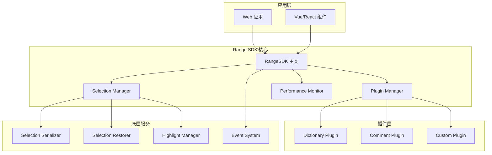
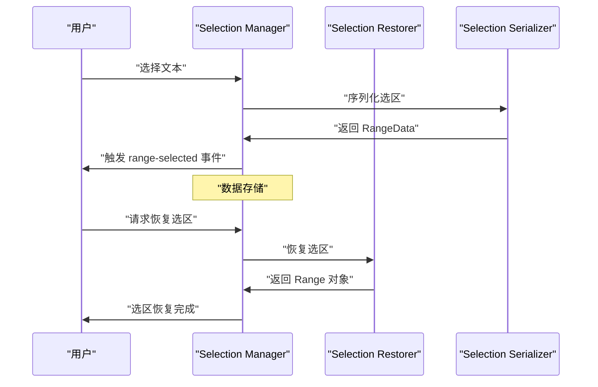
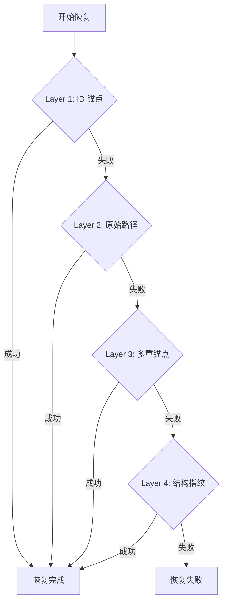
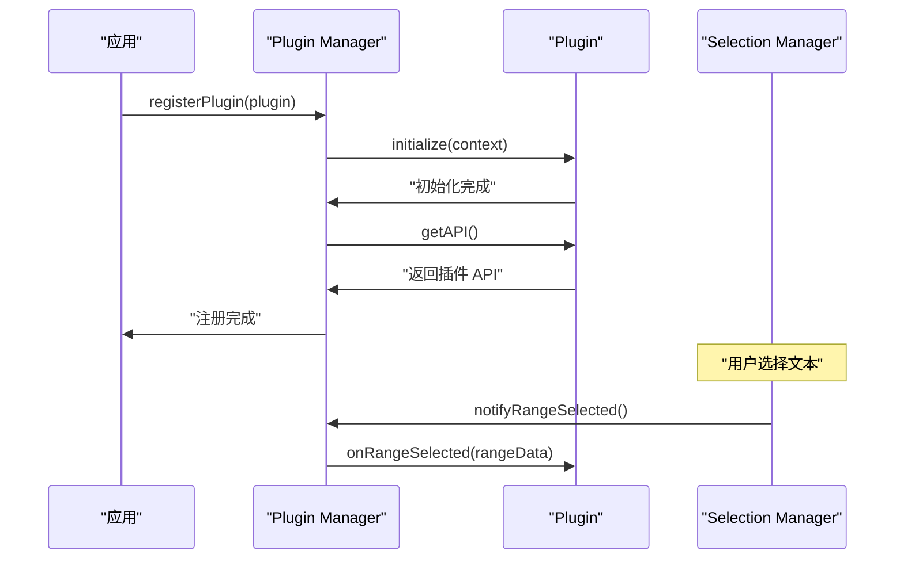
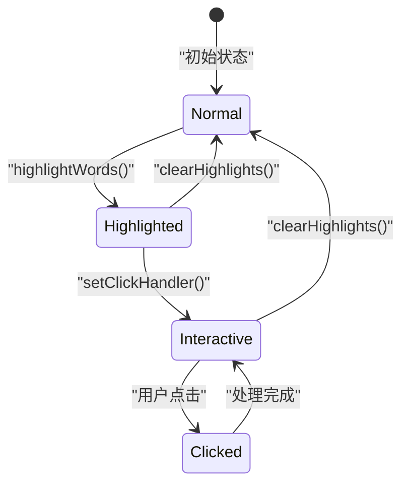
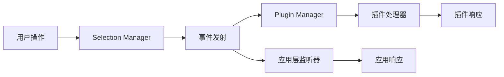
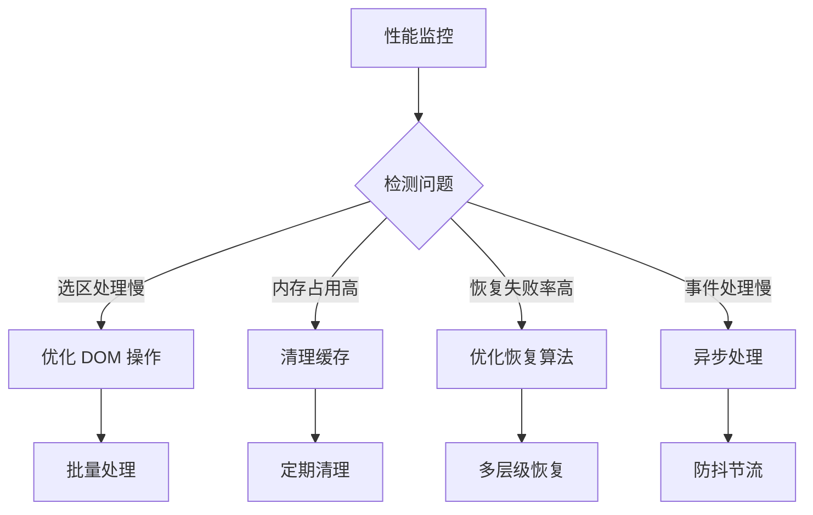
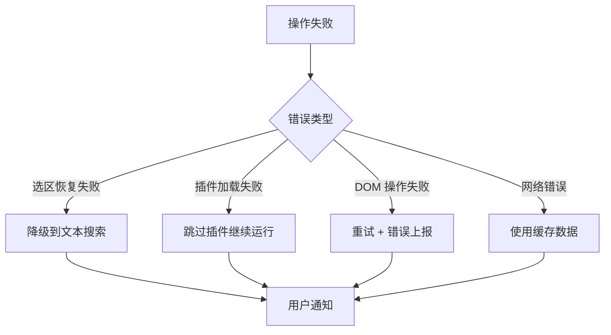

# 核心概念

Range SDK 基于几个核心概念构建，理解这些概念将帮助您更好地使用和扩展 SDK。

## 架构概览



## 1. 选区管理 (Selection Management)

选区管理是 Range SDK 的核心功能，负责捕获、存储和恢复用户在文档中的文本选择。

### 选区数据结构 (RangeData)

```typescript
interface RangeData {
  id: string                    // 唯一标识符
  startContainerPath: string    // 开始容器的 DOM 路径
  startOffset: number           // 开始位置偏移
  endContainerPath: string      // 结束容器的 DOM 路径
  endOffset: number             // 结束位置偏移
  selectedText: string          // 选中的文本内容
  pageUrl: string               // 页面 URL
  timestamp: number             // 创建时间戳
  rect: DOMRect                 // 选区的几何信息
  contextBefore?: string        // 选区前的上下文
  contextAfter?: string         // 选区后的上下文
}
```

### 选区生命周期



### 选区序列化

选区序列化将浏览器的 `Range` 对象转换为可以存储和传输的 JSON 数据：

```typescript
// 自动捕获当前选区
rangeSDK.on('range-selected', (rangeData) => {
  // rangeData 包含了完整的选区信息
  console.log('选中文本：', rangeData.selectedText)
  console.log('DOM 路径：', rangeData.startContainerPath)
})

// 手动获取当前选区
const currentSelection = await rangeSDK.getCurrentSelection()
if (currentSelection) {
  // 保存到数据库或本地存储
  localStorage.setItem('selection', JSON.stringify(currentSelection))
}
```

### 选区恢复

选区恢复是将存储的 `RangeData` 重新转换为浏览器的 `Range` 对象：

```typescript
// 从存储中恢复选区
const savedSelection = JSON.parse(localStorage.getItem('selection') || '{}')
const restoredRange = await rangeSDK.restoreSelection(savedSelection)

if (restoredRange) {
  console.log('选区恢复成功')
} else {
  console.warn('选区恢复失败，可能是页面结构已发生变化')
}
```

### 选区恢复算法层级

Range SDK 使用多层级的恢复算法确保选区恢复的成功率：



## 2. 插件系统 (Plugin System)

插件系统是 Range SDK 的核心扩展机制，允许开发者添加自定义功能。

### 插件接口

```typescript
interface RangePlugin<T extends PluginAPI = PluginAPI> {
  id: string                                    // 插件唯一标识
  name: string                                  // 插件显示名称
  version: string                               // 插件版本
  initialize(context: PluginContext): Promise<void>  // 初始化
  getAPI(): T                                   // 获取插件 API
  onRangeSelected?(rangeData: RangeData): void  // 选区选择事件
  onMarkClicked?(markData: MarkData): void      // 标记点击事件
  destroy?(): void                              // 销毁插件
}
```

### 插件上下文

插件上下文提供插件与 SDK 核心交互的接口：

```typescript
interface PluginContext {
  selectionManager: SelectionManager     // 选区管理器
  emit: (event: string, ...args: any[]) => void  // 事件发射器
  globalConfig: any                      // 全局配置
  performanceMonitor?: IPerformanceMonitor  // 性能监控器
}
```

### 插件注册流程



### 插件类型安全

Range SDK 提供了完整的 TypeScript 类型支持：

```typescript
// 类型安全的插件使用
import { createTypedRangeSDK, type WithDictionary } from '@ad-audit/range-sdk'
import { createDictionaryPlugin, type DictionaryAPI } from '@ad-audit/range-sdk-plugin-dictionary'

// 创建类型安全的 SDK 实例
const rangeSDK = createTypedRangeSDK()
  .withPlugin(createDictionaryPlugin())

// 现在有完整的类型提示
await rangeSDK.dictionary.search({ words: ['API'] })  // ✅ 类型安全
await rangeSDK.dictionary.invalidMethod()             // ❌ TypeScript 错误
```

## 3. 高亮系统 (Highlight System)

高亮系统提供文本标记和视觉反馈功能。

### 高亮管理器

```typescript
interface HighlightManager {
  // 高亮指定词汇
  highlightWords(words: string[], container?: HTMLElement): Promise<void>
  
  // 高亮指定选区
  highlightRange(rangeData: RangeData, duration?: number): Promise<string>
  
  // 清除高亮
  clearHighlights(container?: HTMLElement): void
  
  // 设置高亮样式
  setStyle(style: Partial<HighlightStyle>): void
  
  // 设置点击处理器
  setClickHandler(handler: (target: HTMLElement, keyword: string) => void): void
}
```

### 高亮样式配置

```typescript
interface HighlightStyle {
  backgroundColor?: string      // 背景色
  borderBottom?: string         // 下边框
  borderRadius?: string         // 圆角
  cursor?: string              // 鼠标样式
  padding?: string             // 内边距
  color?: string               // 文字颜色
  fontWeight?: string          // 字体粗细
}

// 自定义高亮样式
const customStyle: HighlightStyle = {
  backgroundColor: 'rgba(255, 235, 59, 0.3)',
  borderBottom: '2px solid #FFC107',
  borderRadius: '3px',
  cursor: 'pointer'
}
```

### 高亮生命周期



## 4. 事件系统 (Event System)

Range SDK 使用事件驱动架构实现松耦合的组件通信。

### 核心事件

```typescript
interface RangeSDKEvents {
  // 选区相关事件
  'range-selected': (rangeData: RangeData) => void
  'range-restored': (rangeData: RangeData) => void
  'range-cleared': () => void
  
  // 标记相关事件
  'mark-clicked': (markData: MarkData) => void
  'mark-created': (markData: MarkData) => void
  'mark-removed': (markId: string) => void
  
  // 插件相关事件
  'plugin-registered': (pluginId: string) => void
  'plugin-unregistered': (pluginId: string) => void
  
  // 性能相关事件
  'performance-warning': (warning: PerformanceWarning) => void
}
```

### 事件监听和发射

```typescript
// 监听事件
rangeSDK.on('range-selected', (rangeData) => {
  console.log('用户选择：', rangeData.selectedText)
})

// 监听标记点击
rangeSDK.on('mark-clicked', (markData) => {
  console.log('点击标记：', markData)
})

// 移除事件监听
const handler = (rangeData) => { /* ... */ }
rangeSDK.on('range-selected', handler)
rangeSDK.off('range-selected', handler)
```

### 事件流



## 5. 性能监控 (Performance Monitoring)

性能监控系统帮助开发者了解 SDK 的运行状态和性能表现。

### 性能指标

```typescript
interface PerformanceMetrics {
  selectionCount: number           // 选区操作次数
  restorationCount: number         // 恢复操作次数
  highlightCount: number           // 高亮操作次数
  averageSelectionTime: number     // 平均选区处理时间
  averageRestorationTime: number   // 平均恢复处理时间
  memoryUsage: number             // 内存使用量
  errorCount: number              // 错误次数
}
```

### 性能报告

```typescript
// 获取性能报告
const report = rangeSDK.getPerformanceReport()
console.log('性能报告：', {
  totalSelections: report.selectionCount,
  averageTime: report.averageSelectionTime,
  successRate: (report.selectionCount - report.errorCount) / report.selectionCount
})

// 清理性能指标
rangeSDK.clearPerformanceMetrics()
```

### 性能优化建议



## 6. 配置系统

### SDK 配置

```typescript
interface RangeSDKOptions {
  container?: Element                    // 容器元素
  debug?: boolean                       // 调试模式
  performance?: PerformanceMonitorConfig | boolean  // 性能监控
  
  // 选区配置
  selection?: {
    autoCapture?: boolean              // 自动捕获选区
    minTextLength?: number             // 最小文本长度
    excludeSelectors?: string[]        // 排除的选择器
  }
  
  // 高亮配置
  highlight?: {
    defaultStyle?: Partial<HighlightStyle>  // 默认样式
    animationDuration?: number         // 动画持续时间
  }
}
```

### 插件配置

```typescript
// Dictionary 插件配置示例
const dictionaryConfig: DictionaryPluginConfig = {
  // 数据源配置
  mockData?: Record<string, DictionaryEntry>
  apiEndpoint?: string
  
  // 高亮配置
  highlightStyle?: Partial<HighlightStyle>
  autoHighlight?: boolean
  
  // 界面配置
  container?: HTMLElement
  cardMaxWidth?: number
  cardPosition?: 'auto' | 'top' | 'bottom'
}
```

## 7. 错误处理

### 错误类型

```typescript
// 选区恢复错误
class SelectionRestorationError extends Error {
  constructor(
    public rangeData: RangeData,
    public reason: 'DOM_CHANGED' | 'ELEMENT_NOT_FOUND' | 'INVALID_RANGE'
  ) {
    super(`Failed to restore selection: ${reason}`)
  }
}

// 插件加载错误
class PluginLoadError extends Error {
  constructor(
    public pluginId: string,
    public originalError: Error
  ) {
    super(`Failed to load plugin ${pluginId}: ${originalError.message}`)
  }
}
```

### 错误处理策略



## 8. 最佳实践

### 性能优化

```typescript
// 批量操作
const keywords = ['API', 'SDK', 'JavaScript']
await rangeSDK.dictionary.search({ words: keywords })  // ✅ 批量处理

// 避免频繁操作
keywords.forEach(async keyword => {
  await rangeSDK.dictionary.search({ words: [keyword] })  // ❌ 逐个处理
})
```

### 内存管理

```typescript
// 组件销毁时清理资源
onUnmounted(() => {
  rangeSDK.destroy()  // 清理所有监听器和资源
})

// 定期清理性能指标
setInterval(() => {
  rangeSDK.clearPerformanceMetrics()
}, 5 * 60 * 1000)  // 每 5 分钟清理一次
```

### 错误处理

```typescript
// 监听性能警告
rangeSDK.on('performance-warning', (warning) => {
  if (warning.type === 'MEMORY_HIGH') {
    console.warn('内存使用过高，建议清理缓存')
    rangeSDK.clearPerformanceMetrics()
  }
})

// 优雅的错误处理
try {
  await rangeSDK.restoreSelection(rangeData)
} catch (error) {
  if (error instanceof SelectionRestorationError) {
    console.warn('选区恢复失败，尝试文本搜索', error.reason)
    // 降级处理
  }
}
```

---

理解了这些核心概念后，您就可以充分发挥 Range SDK 的能力。接下来建议查看 [API 参考文档](../api/core-api.md) 了解具体的接口使用方法。