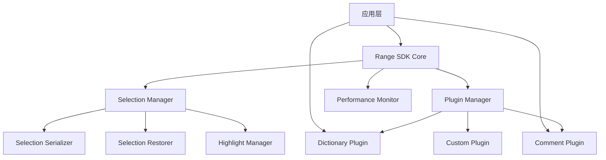

# Range SDK 文档

Range SDK 是一个强大且灵活的文档选区管理 SDK，专为企业级应用设计。它提供了完整的选区管理、插件系统和高亮功能，帮助开发者快速构建交互式文档应用。

## 特性

- **选区管理**：强大的文本选区捕获、存储和恢复功能
- **插件系统**：可扩展的插件架构，支持自定义功能扩展
- **高亮系统**：灵活的文本高亮和标注功能
- **性能监控**：内置性能监控，助力应用优化
- **类型安全**：完整的 TypeScript 支持，提供强类型检查
- **跨浏览器兼容**：支持现代浏览器的完整功能

## 架构概览



## 快速开始

### 安装

```bash
npm install @ad-audit/range-sdk
```

### 基本使用

```typescript
import { RangeSDK } from '@ad-audit/range-sdk'

// 创建 SDK 实例
const rangeSDK = new RangeSDK({
  container: document.body,
  debug: true
})

// 监听选区事件
rangeSDK.on('range-selected', (rangeData) => {
  console.log('用户选择了文本：', rangeData.selectedText)
})

// 恢复选区
const savedRange = await rangeSDK.getCurrentSelection()
if (savedRange) {
  await rangeSDK.restoreSelection(savedRange)
}
```

### 插件使用

```typescript
import { createDictionaryPlugin } from '@ad-audit/range-sdk-plugin-dictionary'

// 创建词典插件
const dictionaryPlugin = createDictionaryPlugin({
  mockData: {
    'API': {
      id: 1,
      word: 'API',
      content: '应用程序编程接口',
      tags: ['技术', '编程']
    }
  }
})

// 注册插件
await rangeSDK.registerPlugin(dictionaryPlugin)

// 搜索并高亮词汇
await rangeSDK.dictionary.search({
  words: ['API', 'SDK']
})
```

## 文档导航

### 入门指南
- [安装指南](./guide/installation.md) - 如何安装和配置 Range SDK
- [快速开始](./guide/quick-start.md) - 5分钟上手 Range SDK
- [核心概念](./guide/core-concepts.md) - 理解 Range SDK 的设计理念

### API 参考
- [核心 API](./api/core-api.md) - Range SDK 核心功能接口
- [插件系统](./api/plugin-system.md) - 插件开发和管理接口
- [类型参考](./api/type-reference.md) - 完整的 TypeScript 类型定义

### 插件开发
- [插件开发指南](./plugins/development-guide.md) - 如何开发自定义插件

### 最佳实践
- [Dictionary 插件最佳实践](./best-practices/dictionary-plugin.md) - 词典插件使用最佳实践

### 架构设计
- [架构概览](./architecture/overview.md) - Range SDK 的整体架构设计

### 其他
- [故障排除](./troubleshooting.md) - 常见问题和解决方案
- [Playground](./playground/index.md) - 在线示例和实验

## 生态系统

### 官方插件
- **Dictionary Plugin** - 企业词典插件，支持术语解释和知识管理
- **Comment Plugin** - 评论插件，支持协作评论功能
- **Highlight Plugin** - 高亮插件，支持多样式文本标注

### 社区插件
- 更多插件正在开发中，敬请期待...

## 版本历史

### v1.0.0 (当前)
- 核心选区管理功能
- 插件系统架构
- Dictionary 插件
- 性能监控系统
- TypeScript 完整支持

## 支持和反馈

如果您在使用过程中遇到问题或有改进建议，请：

1. 查看 [故障排除](./troubleshooting.md) 文档
2. 在内部反馈渠道提交问题
3. 参考 [Playground](./playground/index.md) 中的示例

## 许可证

MIT License - 详见项目根目录 LICENSE 文件

---

*最后更新：2025-08-06*