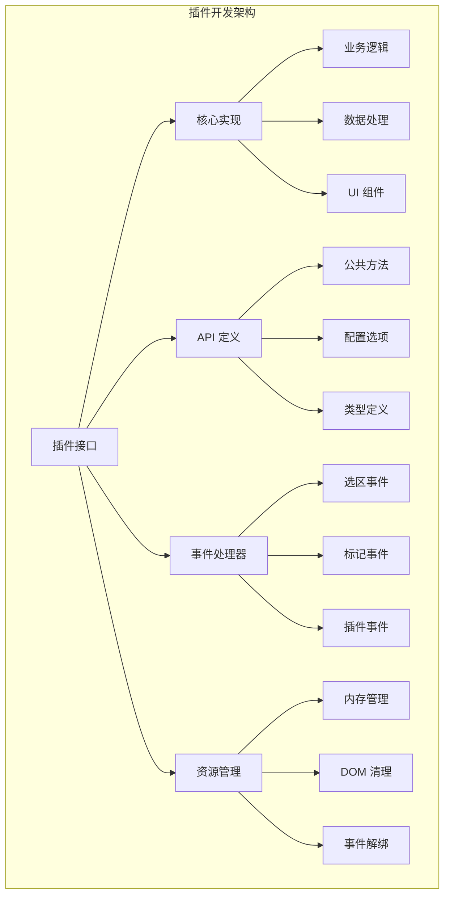

# 插件开发指南

本指南详细介绍如何为 Range SDK 开发自定义插件，包括设计原则、开发流程、最佳实践和发布指南。

## 插件开发概述

Range SDK 插件是遵循特定接口规范的独立模块，可以扩展 SDK 的功能。插件具有以下特点：

- **独立性**：插件可以独立开发、测试和发布
- **可组合性**：多个插件可以同时工作，互不干扰
- **生命周期管理**：SDK 管理插件的初始化、运行和销毁
- **类型安全**：完整的 TypeScript 支持
- **事件驱动**：基于事件系统实现松耦合通信

## 插件架构



## 开发环境设置

### 1. 项目初始化

```bash
# 创建插件项目
mkdir my-range-plugin
cd my-range-plugin

# 初始化项目
npm init -y

# 安装依赖
npm install @ad-audit/range-sdk
npm install -D typescript @types/node vitest rollup
```

### 2. 项目结构

```
my-range-plugin/
├── src/
│   ├── index.ts          # 插件主入口
│   ├── plugin.ts         # 插件实现
│   ├── types.ts          # 类型定义
│   ├── api.ts            # API实现
│   ├── components/       # UI组件
│   └── utils/            # 工具函数
├── tests/
│   ├── unit/             # 单元测试
│   ├── integration/      # 集成测试
│   └── fixtures/         # 测试数据
├── docs/
│   ├── README.md         # 插件文档
│   └── examples/         # 使用示例
├── package.json
├── tsconfig.json
├── rollup.config.js
└── vitest.config.ts
```

### 3. TypeScript 配置

```json
// tsconfig.json
{
  "compilerOptions": {
    "target": "ES2020",
    "lib": ["ES2020", "DOM", "DOM.Iterable"],
    "module": "ESNext",
    "moduleResolution": "node",
    "declaration": true,
    "declarationMap": true,
    "outDir": "./dist",
    "rootDir": "./src",
    "strict": true,
    "esModuleInterop": true,
    "skipLibCheck": true,
    "forceConsistentCasingInFileNames": true
  },
  "include": ["src/**/*"],
  "exclude": ["node_modules", "dist", "tests"]
}
```

## 插件开发步骤

### 第一步：定义插件接口

```typescript
// src/types.ts
import type { PluginAPI, RangeData, MarkData } from '@ad-audit/range-sdk'

// 插件配置接口
export interface MyPluginConfig {
  enabled?: boolean
  apiEndpoint?: string
  theme?: 'light' | 'dark'
  customSettings?: Record<string, any>
}

// 插件API接口
export interface MyPluginAPI extends PluginAPI {
  // 公共方法
  processText(text: string): Promise<ProcessResult>
  highlight(words: string[]): Promise<void>
  clear(): void
  
  // 配置方法
  updateConfig(config: Partial<MyPluginConfig>): void
  getConfig(): MyPluginConfig
  
  // 状态方法
  isEnabled(): boolean
  getStats(): PluginStats
}

// 数据类型定义
export interface ProcessResult {
  processedText: string
  metadata: Record<string, any>
  timestamp: number
}

export interface PluginStats {
  processCount: number
  highlightCount: number
  errorCount: number
  averageProcessTime: number
}
```

### 第二步：实现插件核心逻辑

```typescript
// src/plugin.ts
import type { 
  RangePlugin, 
  PluginContext, 
  RangeData, 
  MarkData 
} from '@ad-audit/range-sdk'
import type { MyPluginAPI, MyPluginConfig, ProcessResult, PluginStats } from './types'

export class MyPlugin implements RangePlugin<MyPluginAPI> {
  // 插件基本信息
  readonly id = 'my-plugin'
  readonly name = '我的插件'
  readonly version = '1.0.0'
  
  // 插件元数据
  readonly metadata = {
    description: '这是一个示例插件，演示插件开发的完整流程',
    author: 'Your Name',
    license: 'MIT',
    keywords: ['range-sdk', 'plugin', 'text-processing'],
    homepage: 'https://github.com/your-org/my-range-plugin',
    
    // 兼容性信息
    rangeSDKVersion: '^1.0.0',
    browserSupport: ['Chrome 80+', 'Firefox 78+', 'Safari 13+'],
    
    // 功能特性
    features: [
      '文本处理',
      '智能高亮',
      '主题支持',
      '性能监控'
    ]
  }
  
  // 私有属性
  private context?: PluginContext
  private config: MyPluginConfig
  private isInitialized = false
  private stats: PluginStats = {
    processCount: 0,
    highlightCount: 0,
    errorCount: 0,
    averageProcessTime: 0
  }
  private processingTimes: number[] = []
  
  constructor(config: MyPluginConfig = {}) {
    // 合并默认配置
    this.config = {
      enabled: true,
      theme: 'light',
      ...config
    }
  }
  
  // 插件初始化
  async initialize(context: PluginContext): Promise<void> {
    if (this.isInitialized) {
      throw new Error('Plugin already initialized')
    }
    
    try {
      this.context = context
      
      // 验证配置
      this.validateConfig()
      
      // 初始化资源
      await this.initializeResources()
      
      // 设置错误处理
      this.setupErrorHandling()
      
      // 注册事件处理器
      this.registerEventHandlers()
      
      this.isInitialized = true
      
      // 发送初始化完成事件
      this.context.emit('plugin-initialized', {
        pluginId: this.id,
        config: this.config
      })
      
    } catch (error) {
      this.handleError('initialize', error)
      throw new Error(`Failed to initialize plugin ${this.name}: ${error.message}`)
    }
  }
  
  private validateConfig(): void {
    if (this.config.apiEndpoint && !this.isValidUrl(this.config.apiEndpoint)) {
      throw new Error('Invalid API endpoint URL')
    }
    
    if (this.config.theme && !['light', 'dark'].includes(this.config.theme)) {
      throw new Error('Invalid theme, must be "light" or "dark"')
    }
  }
  
  private async initializeResources(): Promise<void> {
    // 初始化HTTP客户端
    if (this.config.apiEndpoint) {
      // this.httpClient = new HttpClient(this.config.apiEndpoint)
    }
    
    // 初始化UI组件
    this.initializeUI()
    
    // 加载必要的资源
    await this.loadResources()
  }
  
  private initializeUI(): void {
    // 注入样式
    this.injectStyles()
    
    // 创建UI容器
    this.createUIContainer()
  }
  
  private injectStyles(): void {
    const styleId = `${this.id}-styles`
    
    if (document.getElementById(styleId)) return
    
    const style = document.createElement('style')
    style.id = styleId
    style.textContent = this.getPluginStyles()
    
    document.head.appendChild(style)
  }
  
  private getPluginStyles(): string {
    const theme = this.config.theme
    
    return `
      .my-plugin-container {
        --primary-color: ${theme === 'dark' ? '#40a9ff' : '#1890ff'};
        --bg-color: ${theme === 'dark' ? '#1f1f1f' : '#ffffff'};
        --text-color: ${theme === 'dark' ? '#ffffff' : '#333333'};
        --border-color: ${theme === 'dark' ? '#434343' : '#e1e5e9'};
      }
      
      .my-plugin-highlight {
        background-color: var(--primary-color, #1890ff);
        opacity: 0.2;
        cursor: pointer;
        transition: opacity 0.2s ease;
      }
      
      .my-plugin-highlight:hover {
        opacity: 0.3;
      }
      
      .my-plugin-panel {
        position: fixed;
        background: var(--bg-color);
        color: var(--text-color);
        border: 1px solid var(--border-color);
        border-radius: 6px;
        box-shadow: 0 4px 12px rgba(0, 0, 0, 0.1);
        z-index: 1000;
        max-width: 400px;
        padding: 16px;
      }
    `
  }
  
  private createUIContainer(): void {
    const container = document.createElement('div')
    container.id = `${this.id}-container`
    container.className = 'my-plugin-container'
    container.style.display = 'none'
    
    document.body.appendChild(container)
  }
  
  private async loadResources(): Promise<void> {
    // 加载配置文件、语言包等资源
    try {
      if (this.config.customSettings?.configUrl) {
        const response = await fetch(this.config.customSettings.configUrl)
        const externalConfig = await response.json()
        this.config = { ...this.config, ...externalConfig }
      }
    } catch (error) {
      console.warn('Failed to load external config:', error)
    }
  }
  
  private setupErrorHandling(): void {
    // 设置全局错误处理
    window.addEventListener('error', (event) => {
      if (event.error?.pluginId === this.id) {
        this.handleError('runtime', event.error)
      }
    })
    
    // 设置Promise错误处理
    window.addEventListener('unhandledrejection', (event) => {
      if (event.reason?.pluginId === this.id) {
        this.handleError('promise', event.reason)
      }
    })
  }
  
  private registerEventHandlers(): void {
    // 注册内部事件处理器
    // 这里可以添加插件特定的事件监听
  }
  
  // 选区选择事件处理
  onRangeSelected(rangeData: RangeData): void {
    if (!this.isInitialized || !this.config.enabled) return
    
    try {
      this.processRangeSelection(rangeData)
    } catch (error) {
      this.handleError('onRangeSelected', error)
    }
  }
  
  private async processRangeSelection(rangeData: RangeData): Promise<void> {
    const startTime = Date.now()
    
    try {
      // 处理选区文本
      const result = await this.processText(rangeData.selectedText)
      
      // 更新统计信息
      this.updateStats('process', startTime)
      
      // 发送处理结果事件
      this.context?.emit('plugin-text-processed', {
        pluginId: this.id,
        rangeData,
        result
      })
      
    } catch (error) {
      this.stats.errorCount++
      throw error
    }
  }
  
  // 标记点击事件处理
  onMarkClicked(markData: MarkData): void {
    if (!this.isInitialized || !this.config.enabled) return
    
    try {
      this.handleMarkClick(markData)
    } catch (error) {
      this.handleError('onMarkClicked', error)
    }
  }
  
  private handleMarkClick(markData: MarkData): void {
    // 显示详情面板
    this.showDetailPanel(markData)
  }
  
  private showDetailPanel(markData: MarkData): void {
    const panel = document.createElement('div')
    panel.className = 'my-plugin-panel'
    panel.innerHTML = `
      <div class="panel-header">
        <h3>文本详情</h3>
        <button class="close-btn" onclick="this.parentElement.parentElement.remove()">×</button>
      </div>
      <div class="panel-content">
        <p><strong>文本:</strong> ${markData.selectedText}</p>
        <p><strong>位置:</strong> (${markData.rect.x}, ${markData.rect.y})</p>
        <p><strong>时间:</strong> ${new Date(markData.timestamp).toLocaleString()}</p>
      </div>
    `
    
    // 定位面板
    panel.style.left = `${markData.rect.x}px`
    panel.style.top = `${markData.rect.bottom + 10}px`
    
    document.body.appendChild(panel)
    
    // 3秒后自动关闭
    setTimeout(() => panel.remove(), 3000)
  }
  
  // 获取插件API
  getAPI(): MyPluginAPI {
    return {
      processText: (text: string) => this.processText(text),
      highlight: (words: string[]) => this.highlight(words),
      clear: () => this.clear(),
      updateConfig: (config: Partial<MyPluginConfig>) => this.updateConfig(config),
      getConfig: () => this.getConfig(),
      isEnabled: () => this.isEnabled(),
      getStats: () => this.getStats()
    }
  }
  
  // API实现
  async processText(text: string): Promise<ProcessResult> {
    if (!this.isInitialized) {
      throw new Error('Plugin not initialized')
    }
    
    const startTime = Date.now()
    
    try {
      // 实际的文本处理逻辑
      const processedText = await this.doTextProcessing(text)
      
      const result: ProcessResult = {
        processedText,
        metadata: {
          originalLength: text.length,
          processedLength: processedText.length,
          processingTime: Date.now() - startTime
        },
        timestamp: Date.now()
      }
      
      this.updateStats('process', startTime)
      
      return result
      
    } catch (error) {
      this.stats.errorCount++
      throw error
    }
  }
  
  private async doTextProcessing(text: string): Promise<string> {
    // 模拟异步文本处理
    await new Promise(resolve => setTimeout(resolve, 100))
    
    // 简单的处理示例：添加前缀
    return `[Processed] ${text}`
  }
  
  async highlight(words: string[]): Promise<void> {
    if (!this.isInitialized || words.length === 0) return
    
    const startTime = Date.now()
    
    try {
      // 高亮逻辑
      await this.performHighlight(words)
      
      this.updateStats('highlight', startTime)
      
    } catch (error) {
      this.stats.errorCount++
      throw error
    }
  }
  
  private async performHighlight(words: string[]): Promise<void> {
    // 遍历文档中的文本节点
    const walker = document.createTreeWalker(
      document.body,
      NodeFilter.SHOW_TEXT,
      null,
      false
    )
    
    let node
    const nodesToProcess: { node: Text, word: string, index: number }[] = []
    
    while (node = walker.nextNode()) {
      const text = node.textContent || ''
      
      for (const word of words) {
        let index = 0
        let searchIndex
        
        while ((searchIndex = text.indexOf(word, index)) !== -1) {
          nodesToProcess.push({
            node: node as Text,
            word,
            index: searchIndex
          })
          index = searchIndex + word.length
        }
      }
    }
    
    // 批量处理高亮
    this.batchHighlight(nodesToProcess)
  }
  
  private batchHighlight(nodesToProcess: { node: Text, word: string, index: number }[]): void {
    // 按节点分组处理，避免DOM操作冲突
    const nodeGroups = new Map<Text, { word: string, index: number }[]>()
    
    for (const item of nodesToProcess) {
      if (!nodeGroups.has(item.node)) {
        nodeGroups.set(item.node, [])
      }
      nodeGroups.get(item.node)!.push({ word: item.word, index: item.index })
    }
    
    // 处理每个节点
    for (const [node, highlights] of nodeGroups.entries()) {
      this.highlightInNode(node, highlights)
    }
  }
  
  private highlightInNode(node: Text, highlights: { word: string, index: number }[]): void {
    const parent = node.parentNode
    if (!parent) return
    
    // 按位置排序，从后往前处理避免索引变化
    highlights.sort((a, b) => b.index - a.index)
    
    let currentNode = node
    
    for (const { word, index } of highlights) {
      const range = document.createRange()
      range.setStart(currentNode, index)
      range.setEnd(currentNode, index + word.length)
      
      const span = document.createElement('span')
      span.className = 'my-plugin-highlight'
      span.dataset.word = word
      
      try {
        range.surroundContents(span)
        
        // 绑定点击事件
        span.addEventListener('click', (e) => {
          e.stopPropagation()
          this.handleHighlightClick(span, word)
        })
        
      } catch (error) {
        console.warn('Failed to highlight text:', error)
      }
    }
  }
  
  private handleHighlightClick(element: HTMLSpanElement, word: string): void {
    const rect = element.getBoundingClientRect()
    
    // 创建模拟的MarkData
    const markData: MarkData = {
      id: `highlight-${Date.now()}`,
      selectedText: word,
      rect,
      pluginName: this.name,
      timestamp: Date.now(),
      metadata: { type: 'highlight-click' }
    }
    
    this.handleMarkClick(markData)
  }
  
  clear(): void {
    // 清除所有高亮
    const highlights = document.querySelectorAll('.my-plugin-highlight')
    highlights.forEach(element => {
      const parent = element.parentNode
      if (parent) {
        // 将高亮元素替换为原始文本
        const textNode = document.createTextNode(element.textContent || '')
        parent.replaceChild(textNode, element)
        
        // 合并相邻的文本节点
        parent.normalize()
      }
    })
    
    // 清除UI面板
    const panels = document.querySelectorAll('.my-plugin-panel')
    panels.forEach(panel => panel.remove())
  }
  
  updateConfig(config: Partial<MyPluginConfig>): void {
    this.config = { ...this.config, ...config }
    
    // 重新应用配置
    this.applyConfigChanges(config)
    
    // 发送配置更新事件
    this.context?.emit('plugin-config-updated', {
      pluginId: this.id,
      config: this.config
    })
  }
  
  private applyConfigChanges(changes: Partial<MyPluginConfig>): void {
    // 如果主题发生变化，更新样式
    if (changes.theme) {
      this.updateTheme()
    }
    
    // 如果启用状态发生变化
    if (changes.enabled !== undefined) {
      if (!changes.enabled) {
        this.clear()
      }
    }
  }
  
  private updateTheme(): void {
    // 移除旧样式
    const oldStyle = document.getElementById(`${this.id}-styles`)
    if (oldStyle) {
      oldStyle.remove()
    }
    
    // 重新注入样式
    this.injectStyles()
  }
  
  getConfig(): MyPluginConfig {
    return { ...this.config }
  }
  
  isEnabled(): boolean {
    return this.config.enabled || false
  }
  
  getStats(): PluginStats {
    return { ...this.stats }
  }
  
  private updateStats(operation: 'process' | 'highlight', startTime: number): void {
    const duration = Date.now() - startTime
    
    if (operation === 'process') {
      this.stats.processCount++
    } else if (operation === 'highlight') {
      this.stats.highlightCount++
    }
    
    // 更新平均处理时间
    this.processingTimes.push(duration)
    if (this.processingTimes.length > 100) {
      this.processingTimes.shift()
    }
    
    this.stats.averageProcessTime = 
      this.processingTimes.reduce((a, b) => a + b, 0) / this.processingTimes.length
  }
  
  private handleError(context: string, error: any): void {
    this.stats.errorCount++
    
    const errorInfo = {
      pluginId: this.id,
      context,
      error: error.message || error.toString(),
      timestamp: Date.now(),
      stack: error.stack
    }
    
    // 记录错误日志
    this.context?.logger?.error?.('Plugin error:', errorInfo)
    
    // 发送错误事件
    this.context?.emit('plugin-error', errorInfo)
    
    // 如果错误过多，自动禁用插件
    if (this.stats.errorCount > 10) {
      console.warn(`Plugin ${this.name} disabled due to too many errors`)
      this.config.enabled = false
    }
  }
  
  private isValidUrl(url: string): boolean {
    try {
      new URL(url)
      return true
    } catch {
      return false
    }
  }
  
  // 插件销毁
  destroy(): void {
    if (!this.isInitialized) return
    
    try {
      // 清理UI
      this.clear()
      
      // 移除样式
      const style = document.getElementById(`${this.id}-styles`)
      if (style) {
        style.remove()
      }
      
      // 移除容器
      const container = document.getElementById(`${this.id}-container`)
      if (container) {
        container.remove()
      }
      
      // 清理事件监听器
      this.cleanupEventListeners()
      
      // 清理其他资源
      this.cleanupResources()
      
      this.isInitialized = false
      
      // 发送销毁完成事件
      this.context?.emit('plugin-destroyed', {
        pluginId: this.id,
        stats: this.stats
      })
      
    } catch (error) {
      console.error(`Error destroying plugin ${this.name}:`, error)
    }
  }
  
  private cleanupEventListeners(): void {
    // 移除全局事件监听器
    // 这里应该移除在setupErrorHandling中添加的监听器
  }
  
  private cleanupResources(): void {
    // 清理HTTP客户端、定时器等资源
    // this.httpClient?.destroy?.()
  }
}
```

### 第三步：创建工厂函数

```typescript
// src/index.ts
import { MyPlugin } from './plugin'
import type { MyPluginConfig, MyPluginAPI } from './types'

export { MyPlugin } from './plugin'
export type { MyPluginConfig, MyPluginAPI, ProcessResult, PluginStats } from './types'

// 工厂函数
export function createMyPlugin(config: MyPluginConfig = {}): MyPlugin {
  return new MyPlugin(config)
}

// 默认导出
export default createMyPlugin
```

## 构建配置

### Rollup 配置

```javascript
// rollup.config.js
import typescript from '@rollup/plugin-typescript'
import resolve from '@rollup/plugin-node-resolve'
import commonjs from '@rollup/plugin-commonjs'
import { terser } from 'rollup-plugin-terser'

export default {
  input: 'src/index.ts',
  
  output: [
    {
      file: 'dist/index.js',
      format: 'esm',
      sourcemap: true
    },
    {
      file: 'dist/index.cjs',
      format: 'cjs',
      sourcemap: true
    },
    {
      file: 'dist/index.umd.js',
      format: 'umd',
      name: 'MyRangePlugin',
      sourcemap: true
    },
    {
      file: 'dist/index.umd.min.js',
      format: 'umd',
      name: 'MyRangePlugin',
      sourcemap: true,
      plugins: [terser()]
    }
  ],
  
  external: ['@ad-audit/range-sdk'],
  
  plugins: [
    resolve(),
    commonjs(),
    typescript({
      tsconfig: './tsconfig.json'
    })
  ]
}
```

### Package.json 配置

```json
{
  "name": "@your-org/my-range-plugin",
  "version": "1.0.0",
  "description": "A custom plugin for Range SDK",
  "keywords": ["range-sdk", "plugin", "text-processing"],
  "author": "Your Name",
  "license": "MIT",
  "homepage": "https://github.com/your-org/my-range-plugin",
  "repository": {
    "type": "git",
    "url": "git+https://github.com/your-org/my-range-plugin.git"
  },
  "bugs": {
    "url": "https://github.com/your-org/my-range-plugin/issues"
  },
  "main": "./dist/index.cjs",
  "module": "./dist/index.js",
  "types": "./dist/index.d.ts",
  "exports": {
    ".": {
      "types": "./dist/index.d.ts",
      "import": "./dist/index.js",
      "require": "./dist/index.cjs"
    }
  },
  "files": [
    "dist",
    "README.md",
    "LICENSE"
  ],
  "scripts": {
    "build": "rollup -c",
    "build:watch": "rollup -c -w",
    "test": "vitest",
    "test:coverage": "vitest --coverage",
    "lint": "eslint src --ext .ts",
    "lint:fix": "eslint src --ext .ts --fix",
    "typecheck": "tsc --noEmit",
    "prepublishOnly": "npm run build && npm run test && npm run lint"
  },
  "peerDependencies": {
    "@ad-audit/range-sdk": "^1.0.0"
  },
  "devDependencies": {
    "@ad-audit/range-sdk": "^1.0.0",
    "@rollup/plugin-commonjs": "^24.0.0",
    "@rollup/plugin-node-resolve": "^15.0.0",
    "@rollup/plugin-typescript": "^11.0.0",
    "@types/node": "^18.0.0",
    "@typescript-eslint/eslint-plugin": "^5.0.0",
    "@typescript-eslint/parser": "^5.0.0",
    "eslint": "^8.0.0",
    "rollup": "^3.0.0",
    "rollup-plugin-terser": "^7.0.0",
    "typescript": "^4.9.0",
    "vitest": "^0.28.0"
  }
}
```

## 测试

### 单元测试

```typescript
// tests/unit/plugin.test.ts
import { describe, it, expect, beforeEach, vi } from 'vitest'
import { MyPlugin } from '../../src/plugin'
import type { PluginContext } from '@ad-audit/range-sdk'

describe('MyPlugin', () => {
  let plugin: MyPlugin
  let mockContext: PluginContext
  
  beforeEach(() => {
    mockContext = {
      selectionManager: {} as any,
      emit: vi.fn(),
      globalConfig: {},
      performanceMonitor: {} as any,
      logger: {
        info: vi.fn(),
        warn: vi.fn(),
        error: vi.fn()
      } as any
    }
    
    plugin = new MyPlugin({
      enabled: true,
      theme: 'light'
    })
  })
  
  describe('initialization', () => {
    it('should initialize successfully', async () => {
      await expect(plugin.initialize(mockContext)).resolves.not.toThrow()
      expect(plugin.isEnabled()).toBe(true)
    })
    
    it('should throw error when initializing twice', async () => {
      await plugin.initialize(mockContext)
      await expect(plugin.initialize(mockContext)).rejects.toThrow()
    })
    
    it('should validate config during initialization', async () => {
      const pluginWithInvalidConfig = new MyPlugin({
        apiEndpoint: 'invalid-url'
      })
      
      await expect(
        pluginWithInvalidConfig.initialize(mockContext)
      ).rejects.toThrow('Invalid API endpoint URL')
    })
  })
  
  describe('API methods', () => {
    beforeEach(async () => {
      await plugin.initialize(mockContext)
    })
    
    it('should process text correctly', async () => {
      const result = await plugin.getAPI().processText('Hello World')
      
      expect(result.processedText).toBe('[Processed] Hello World')
      expect(result.metadata.originalLength).toBe(11)
      expect(result.metadata.processedLength).toBe(23)
    })
    
    it('should update configuration', () => {
      const api = plugin.getAPI()
      
      api.updateConfig({ theme: 'dark' })
      
      expect(api.getConfig().theme).toBe('dark')
      expect(mockContext.emit).toHaveBeenCalledWith(
        'plugin-config-updated',
        expect.objectContaining({
          pluginId: 'my-plugin'
        })
      )
    })
    
    it('should track statistics', async () => {
      const api = plugin.getAPI()
      
      await api.processText('test')
      await api.highlight(['word'])
      
      const stats = api.getStats()
      
      expect(stats.processCount).toBe(1)
      expect(stats.highlightCount).toBe(1)
      expect(stats.averageProcessTime).toBeGreaterThan(0)
    })
  })
  
  describe('event handling', () => {
    beforeEach(async () => {
      await plugin.initialize(mockContext)
    })
    
    it('should handle range selection events', () => {
      const rangeData = {
        id: 'test-range',
        selectedText: 'test text',
        startContainerPath: 'body > p',
        startOffset: 0,
        endContainerPath: 'body > p',
        endOffset: 9,
        pageUrl: 'http://example.com',
        timestamp: Date.now(),
        rect: { x: 0, y: 0, width: 100, height: 20 } as DOMRect
      }
      
      expect(() => plugin.onRangeSelected(rangeData)).not.toThrow()
    })
    
    it('should handle mark click events', () => {
      const markData = {
        id: 'test-mark',
        selectedText: 'test',
        rect: { x: 0, y: 0, width: 50, height: 20 } as DOMRect,
        pluginName: 'my-plugin',
        timestamp: Date.now()
      }
      
      expect(() => plugin.onMarkClicked(markData)).not.toThrow()
    })
  })
  
  describe('cleanup', () => {
    it('should destroy cleanly', async () => {
      await plugin.initialize(mockContext)
      
      expect(() => plugin.destroy()).not.toThrow()
      expect(mockContext.emit).toHaveBeenCalledWith(
        'plugin-destroyed',
        expect.objectContaining({
          pluginId: 'my-plugin'
        })
      )
    })
  })
})
```

### 集成测试

```typescript
// tests/integration/sdk-integration.test.ts
import { describe, it, expect, beforeEach, afterEach } from 'vitest'
import { RangeSDK } from '@ad-audit/range-sdk'
import { createMyPlugin } from '../../src'

describe('SDK Integration', () => {
  let sdk: RangeSDK
  let container: HTMLElement
  
  beforeEach(() => {
    // 创建测试环境
    container = document.createElement('div')
    container.innerHTML = '<p>This is a test document with some text.</p>'
    document.body.appendChild(container)
    
    sdk = new RangeSDK({
      container,
      debug: true
    })
  })
  
  afterEach(() => {
    sdk.destroy()
    document.body.removeChild(container)
  })
  
  it('should register plugin successfully', async () => {
    const plugin = createMyPlugin({
      enabled: true,
      theme: 'light'
    })
    
    await expect(sdk.registerPlugin(plugin)).resolves.not.toThrow()
    
    expect(sdk.hasPlugin?.('my-plugin')).toBe(true)
    expect((sdk as any)['my-plugin']).toBeDefined()
  })
  
  it('should provide plugin API access', async () => {
    const plugin = createMyPlugin()
    await sdk.registerPlugin(plugin)
    
    const api = (sdk as any)['my-plugin']
    
    expect(api.processText).toBeFunction()
    expect(api.highlight).toBeFunction()
    expect(api.getConfig).toBeFunction()
  })
  
  it('should handle SDK events', async () => {
    const plugin = createMyPlugin()
    await sdk.registerPlugin(plugin)
    
    // 模拟选区选择
    const rangeData = {
      id: 'test-range',
      selectedText: 'test',
      // ... 其他属性
    } as any
    
    // 这里需要模拟SDK的事件发射机制
    expect(() => {
      plugin.onRangeSelected(rangeData)
    }).not.toThrow()
  })
})
```

## 发布和分发

### 1. NPM 发布

```bash
# 构建插件
npm run build

# 运行测试
npm test

# 检查包内容
npm pack --dry-run

# 发布
npm publish
```

### 2. 版本管理

```json
// package.json
{
  "scripts": {
    "version:patch": "npm version patch",
    "version:minor": "npm version minor",
    "version:major": "npm version major"
  }
}
```

### 3. CI/CD 配置

```yaml
# .github/workflows/ci.yml
name: CI

on:
  push:
    branches: [main]
  pull_request:
    branches: [main]

jobs:
  test:
    runs-on: ubuntu-latest
    
    steps:
    - uses: actions/checkout@v3
    
    - name: Setup Node.js
      uses: actions/setup-node@v3
      with:
        node-version: '18'
        cache: 'npm'
    
    - name: Install dependencies
      run: npm ci
    
    - name: Run linter
      run: npm run lint
    
    - name: Run tests
      run: npm test
    
    - name: Build
      run: npm run build
  
  publish:
    needs: test
    runs-on: ubuntu-latest
    if: github.ref == 'refs/heads/main'
    
    steps:
    - uses: actions/checkout@v3
    
    - name: Setup Node.js
      uses: actions/setup-node@v3
      with:
        node-version: '18'
        registry-url: 'https://registry.npmjs.org'
    
    - name: Install dependencies
      run: npm ci
    
    - name: Build
      run: npm run build
    
    - name: Publish
      run: npm publish
      env:
        NODE_AUTH_TOKEN: ${{ secrets.NPM_TOKEN }}
```

## 插件文档

### README.md 模板

````markdown
# My Range Plugin

这是一个为 Range SDK 开发的示例插件，演示了文本处理和高亮功能。

## 功能特性

- 🔄 智能文本处理
- 🎨 可自定义高亮样式
- 🌗 支持亮/暗主题
- 📊 性能统计和监控
- 🔧 灵活的配置选项

## 安装

```bash
npm install @your-org/my-range-plugin
```

## 基本使用

```typescript
import { RangeSDK } from '@ad-audit/range-sdk'
import { createMyPlugin } from '@your-org/my-range-plugin'

const rangeSDK = new RangeSDK({
  container: document.body
})

const myPlugin = createMyPlugin({
  enabled: true,
  theme: 'light',
  apiEndpoint: 'https://api.example.com'
})

await rangeSDK.registerPlugin(myPlugin)

// 使用插件 API
await rangeSDK.myPlugin.processText('Hello World')
await rangeSDK.myPlugin.highlight(['important', 'keyword'])
```

## 配置选项

| 选项 | 类型 | 默认值 | 描述 |
|------|------|--------|------|
| `enabled` | boolean | `true` | 是否启用插件 |
| `theme` | 'light' \| 'dark' | `'light'` | 主题模式 |
| `apiEndpoint` | string | - | API 服务端点 |
| `customSettings` | object | `{}` | 自定义配置 |

## API 参考

### processText(text: string): Promise<ProcessResult>

处理文本内容。

### highlight(words: string[]): Promise<void>

高亮指定的词汇列表。

### clear(): void

清除所有高亮和UI元素。

## 开发

```bash
# 克隆仓库
git clone https://github.com/your-org/my-range-plugin.git

# 安装依赖
npm install

# 开发模式
npm run build:watch

# 运行测试
npm test

# 构建
npm run build
```

## 许可证

MIT
````

## 最佳实践总结

1. **模块化设计**：将功能分解为小的、可重用的模块
2. **错误处理**：提供完善的错误处理和恢复机制
3. **性能优化**：注意DOM操作性能，使用批量处理和防抖
4. **内存管理**：正确清理资源，避免内存泄漏
5. **测试覆盖**：编写全面的单元测试和集成测试
6. **文档齐全**：提供清晰的文档和示例
7. **版本兼容**：遵循语义化版本控制
8. **类型安全**：充分利用 TypeScript 类型系统

通过遵循这个开发指南，您可以创建高质量、可维护的 Range SDK 插件，为用户提供强大的文档交互功能。