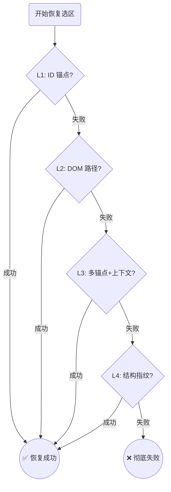
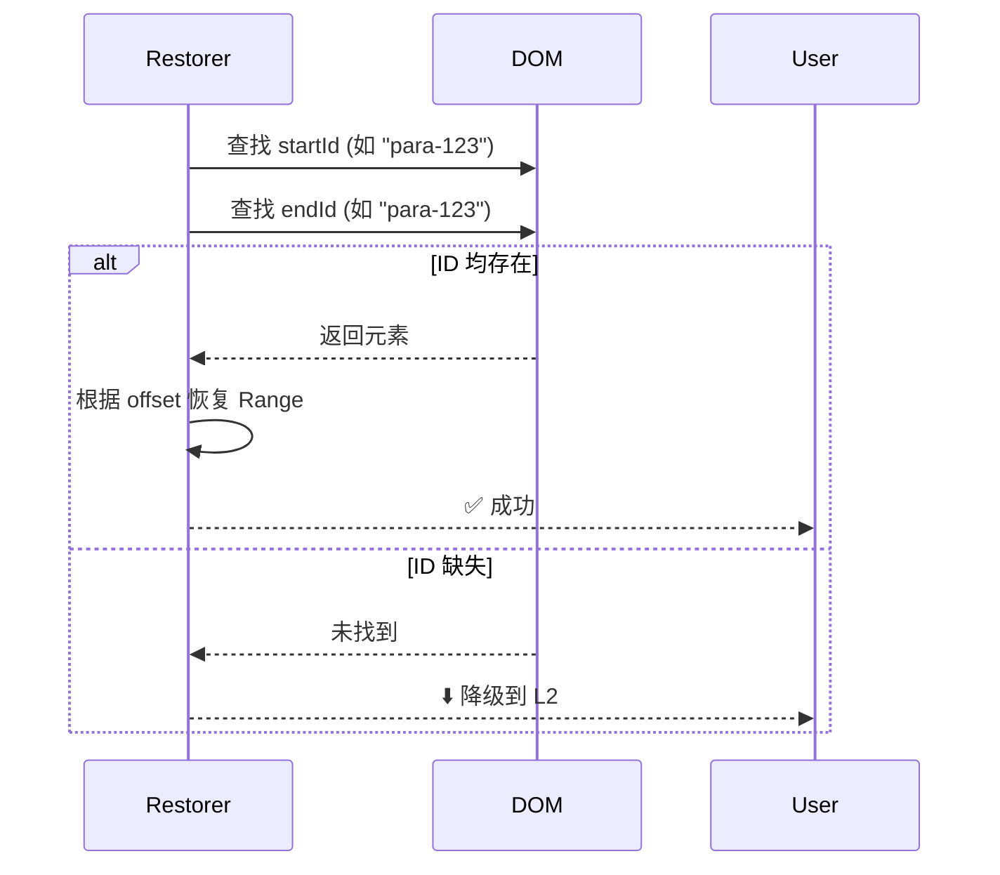
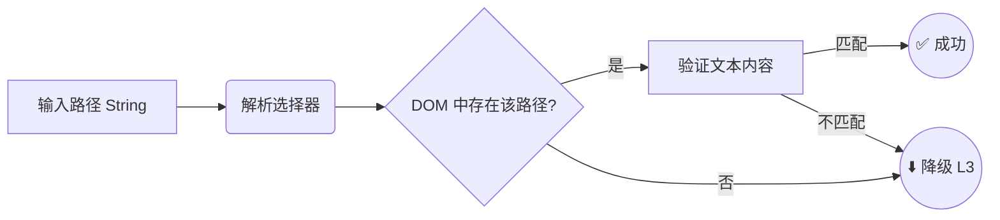
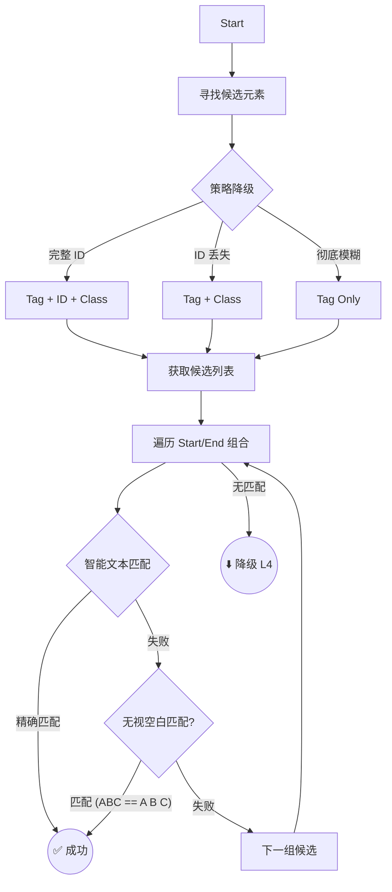
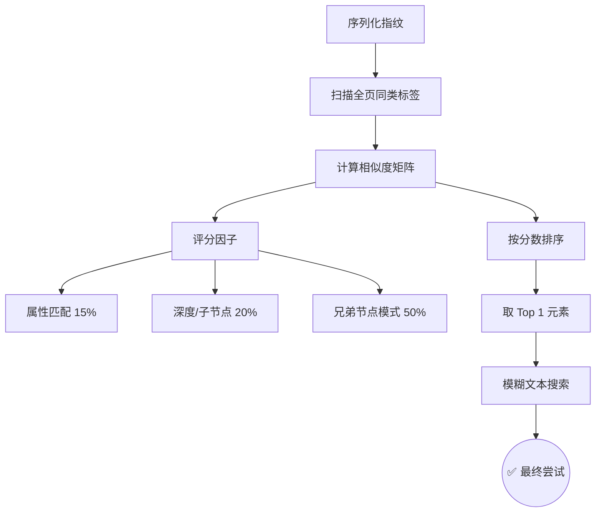

# Range Kit 核心算法详解：四层级联恢复策略

本文档详细解析 `range-kit` 核心的 **四层级联恢复算法 (L1 - L4)**。这套算法旨在解决现代 Web 应用中因动态渲染、内容更新或 DOM 结构微调导致的选区丢失问题。

我们的设计哲学是：**从最精确的锚点开始，逐步降级到模糊特征匹配，确保在各种恶劣的 DOM 环境下仍能“找回”用户的高亮。**

---

## 🎯 概览：恢复漏斗 (The Recovery Funnel)

当尝试恢复一个选区时，系统会依次尝试以下策略。一旦某一层成功（Success），立即返回结果；如果失败（Fail），则无缝滑落到下一层。

---

## 1. 🆔 L1: ID 锚点恢复 (ID Anchor)

### 逻辑原理
这是最快、最精准的策略。如果序列化时记录的起始节点（Start Node）和结束节点（End Node）拥有 `id` 属性，且当前页面中这些 ID 依然存在，直接通过 `document.getElementById` 定位。

### 现实生活举例 🏠
**“按门牌号送快递”**
*   你告诉快递员：“把包裹送到 **贝克街 221B 号**”。
*   只要这条街的门牌号没变，快递员闭着眼睛都能送到，速度极快且绝对准确。

### 算法流程

---

## 2. 🗺️ L2: DOM 路径恢复 (DOM Path)

### 逻辑原理
当元素没有 ID 时，我们记录它在 DOM 树中的“绝对路径”（CSS Selector 路径）。
例如：`body > div#app > article > p:nth-child(3) > span:nth-child(1)`。
恢复时，算法利用 `querySelector` 严格按照这个路径去寻找元素。

### 现实生活举例 🗺️
**“按藏宝图路线寻找”**
*   藏宝图上写着：“从大树出发，向北走 50 米，左转看到红色石头，再向前 10 步”。
*   **风险**：如果中间那块“红色石头”被人搬走了（DOM 结构插入了新元素），后面的路线就全错了。

### 算法流程

---

## 3. ⚓ L3: 多锚点与上下文恢复 (Multiple Anchors) —— **核心防线**

### 逻辑原理
这是 `range-kit` 最强大的层级。当精确的 ID 和路径都失效时（例如 ID 丢失、路径因广告插入而偏移），L3 依靠**局部特征**来定位。

1.  **选择器降级**：如果找 `p#content` 失败，它会尝试找 `p.article-text`，甚至只找 `p` 标签。
2.  **候选集筛选**：找到所有可能的候选元素。
3.  **位置感知匹配**：
    *   对 **Start Element**：检查它是否包含选区的**前缀**。
    *   对 **End Element**：检查它是否包含选区的**后缀**。
4.  **无视空白 (NoSpace Strategy)**：如果 DOM 文本被格式化（多了换行/空格），算法会移除所有空白后进行比对，确保逻辑内容一致。

### 现实生活举例 🕵️
**“凭特征在人群中找人”**
*   你弄丢了朋友的电话号码（ID 丢失），但他告诉你：“我在星巴克旁边（上下文），穿着红衣服（Tag/Class），手里拿着一杯拿铁（文本内容）”。
*   即使他换了座位（路径变了），你依然能在人群中通过这些特征找到他。

### 算法流程

---

## 4. 🧬 L4: 结构指纹恢复 (Structural Fingerprint)

### 逻辑原理
当文本内容本身也被修改（例如修正了错别字），导致 L3 无法匹配时，L4 登场。它不看“你是谁”（ID），也不看“你在哪”（Path），甚至不强求“你说什么”（Text），而是看**“你长什么样”**。

我们计算元素的**结构指纹**：
*   标签名 (Tag Name)
*   类名 (Class List)
*   深度 (Depth)
*   子节点数量 (Child Count)
*   兄弟节点模式 (Sibling Pattern - 前面是 h2，后面是 div)

算法在页面中扫描所有元素，计算**相似度得分 (Similarity Score)**。得分最高的元素即为目标，并在其内部进行模糊文本搜索。

### 现实生活举例 🎨
**“侧写师画像”**
*   目击者描述：“嫌疑人大概 1米8，国字脸，左边有个兄弟像高个子（Sibling），右边有个兄弟是个胖子”。
*   警察在嫌疑人列表中寻找**特征最相似**的人，虽然不能 100% 确定，但八九不离十。

### 算法流程

---

## 总结

| 层级 | 核心依赖 | 适用场景 | 抗干扰能力 | 速度 |
| :--- | :--- | :--- | :--- | :--- |
| **L1** | ID | 静态 ID，理想环境 | ⭐ | 🚀 极快 |
| **L2** | DOM 路径 | ID 缺失，结构未变 | ⭐⭐ | ⚡ 快 |
| **L3** | **特征+文本** | **动态内容，ID/结构微调** | ⭐⭐⭐⭐⭐ | 🐢 中等 |
| **L4** | 统计特征 | 内容修改，结构大变 | ⭐⭐⭐⭐ | 🐌 较慢 |

**Range Kit 的核心竞争力在于 L3 和 L4 的结合**，它使得选区恢复不再是脆弱的“全有或全无”，而是一个具备弹性的智能系统。
