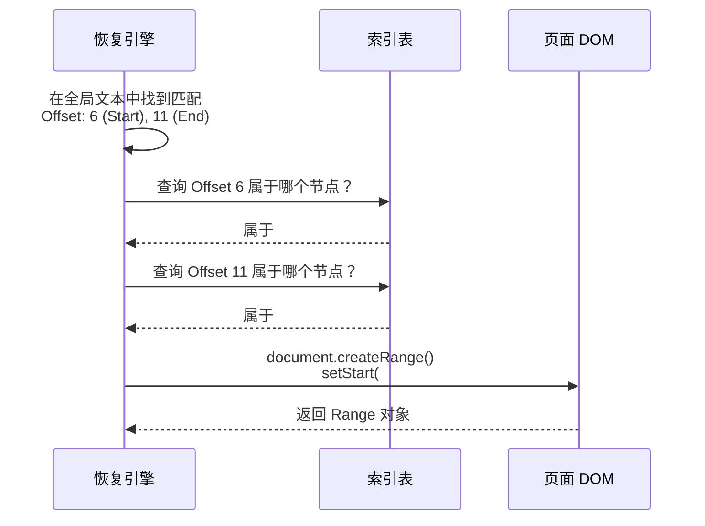

# SOTA 选区恢复方案：W3C Text Quotes 与 全局文本锚定

本文档详细介绍业界最前沿（State of the Art, SOTA）的选区恢复技术，主要基于 **W3C Web Annotation Data Model** 中的 **Text Quote Selector** 规范，并结合 **Google Docs** 等实时协作编辑器的**全局文本锚定 (Global Text Anchoring)** 思想。

这套方案代表了选区恢复技术的终极形态：**彻底免疫 DOM 结构变化 (DOM-Agnostic)**。

---

## 1. 核心理念：从 "DOM 树" 到 "文本流"

传统算法（如 Range Kit 的 L1/L2）将网页视为一棵 **DOM 树**，依赖 `div > p:nth-child(2)` 这样的路径。
SOTA 方案将网页视为一条线性的 **纯文本流 (Text Stream)**。

### 视觉对比

**传统视角 (DOM Tree)**:
```text
BODY
 ├── DIV#app
 │    └── P
 │        ├── "Hello "
 │        └── SPAN.highlight
 │             └── "World"
```
*痛点*：一旦 `SPAN` 被移除，或者 `DIV` 变成了 `SECTION`，路径失效。

**SOTA 视角 (Text Stream)**:
```text
"Hello World"
[01234567890]
```
*优势*：无论 DOM 怎么嵌套，"World" 永远在 "Hello " 后面，处于索引 `6-11` 的位置。

---

## 2. W3C Text Quote Selector 标准

W3C 定义了一种标准化的方式来描述一段文本，不依赖任何 DOM 信息。

### 数据结构
一个 Text Quote Selector 包含三个部分：

```json
{
  "type": "TextQuoteSelector",
  "exact": "目标文本",
  "prefix": "目标文本之前的一段上下文",
  "suffix": "目标文本之后的一段上下文"
}
```

### 现实生活举例 📖
**“凭上下文找名句”**
*   你想在《哈利波特》整本书里找到 "Expecto Patronum" 这句话。
*   书中可能有很多处出现了这句咒语（**歧义**）。
*   为了精准定位，你记录：
    *   **Prefix**: "He shouted, pointing his wand at the Dementor: "
    *   **Exact**: "Expecto Patronum"
    *   **Suffix**: "! A silver stag erupted from the tip."
*   凭借这两段上下文，你可以在全书中**唯一锁定**这一处引用，无论这本书是平装版、精装版，还是电子书（排版/DOM 结构不同）。

---

## 3. 全局文本锚定 (Global Anchoring) 算法流程

### 阶段一：建立索引 (Indexing)
在页面加载时，系统会遍历 DOM，建立 **Text Node** 与 **Global Offset** 的双向映射。

```mermaid
graph TD
    A[遍历 DOM 树] --> B{是 Text Node?}
    B -- 是 --> C[记录节点引用]
    C --> D[累加文本长度]
    D --> E[存入索引表: Range(0, 5) -> NodeA, Range(6, 11) -> NodeB]
    B -- 否 --> A
```

**索引表示例**：
| 全局区间 | 对应 DOM 节点 | 节点内文本 |
| :--- | :--- | :--- |
| `0 - 5` | `#text-node-1` | "Hello " |
| `6 - 11` | `#text-node-2` | "World" |

### 阶段二：模糊搜索 (Fuzzy Search)
当需要恢复选区时，不再使用 `querySelectorAll`，而是直接在全局文本字符串 (`document.body.innerText`) 中搜索。

1.  **提取全局文本**：`const fullText = getAllText(document.body)`。
2.  **Bitap / Myers 搜索**：使用高效的模糊匹配算法，在 `fullText` 中寻找 `prefix + exact + suffix` 的最佳匹配位置。
3.  **容错处理**：允许 `fullText` 和序列化数据之间存在少量差异（如标点变化、错别字修正）。

### 阶段三：映射回 DOM (Remapping)
找到全局的 `startOffset` 和 `endOffset` 后，利用阶段一建立的索引，反向查找对应的 DOM 节点。



---

## 4. 为什么它是 SOTA？(核心优势)

| 特性 | 传统算法 (L1-L4) | SOTA 方案 (W3C/Global) |
| :--- | :--- | :--- |
| **DOM 依赖** | 强依赖 (ID, Class, Path) | **零依赖 (DOM-Agnostic)** |
| **抗结构变化** | 弱 (div 变 span 可能失效) | **极强 (结构重组无影响)** |
| **跨元素选区** | 困难 (需复杂逻辑) | **天然支持 (视为连续文本)** |
| **歧义消除** | 弱 (仅靠 Tag/Text) | **极强 (靠 Prefix/Suffix)** |
| **内容修改** | 几乎无法恢复 | **支持模糊匹配 (Fuzzy)** |

## 5. 挑战与代价

虽然 SOTA 方案极其强大，但它并非没有代价：

1.  **性能开销 (Memory & CPU)**：
    *   需要维护一份全页面的文本索引。对于几十万字的文档，索引构建和更新（MutationObserver）成本较高。
2.  **动态性同步**：
    *   当页面通过 JS 动态插入内容时，全局索引必须实时更新，否则偏移量会错乱。
3.  **不可见内容**：
    *   `display: none` 元素是否应该包含在文本流中？这是一个复杂的业务决策问题。

---

## 6. Range Kit 的演进方向

目前的 Range Kit 处于 **Level 2 (Robust DOM Matching)** 阶段。
通过引入 SOTA 方案，我们可以将其推进到 **Level 3 (Semantic Text Anchoring)**：

1.  **保留 L1/L2** 作为快速通道（性能优先）。
2.  **升级 L3/L4**：当 DOM 查找失败时，不再仅仅依赖结构指纹，而是回退到 **SOTA 全局文本搜索**。
3.  这将使 Range Kit 兼具传统算法的高性能和 SOTA 算法的极致鲁棒性。
